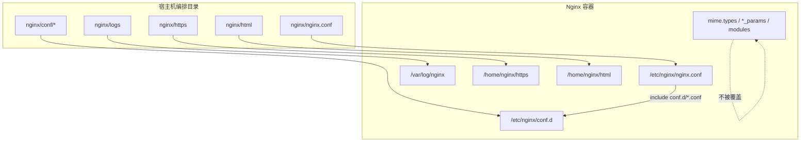

<!-- toc -->

# 背景

Portainer可视化容器管理部署nginx堆栈服务，存在多个配置文件需要挂载的情况下，服务发生更新，增加的扩展配置也需要挂载到执行容器目录，否则服务更新，配置加载失败导致服务集群代理失效。
为了解决这个问题，将nginx相关配置划分为主配置nginx.conf和扩展配置文件夹conf.d,nginx镜像默认加载主配置和配置文件夹，nginx服务部署之后后续如果需要添加额外的配置可以直接存放在nginx容器默认挂载目录conf.d内，
修改nginx.conf引用添加的扩展配置即可。 


| 项    | 说明                                               |
|:-----|:-------------------------------------------------|
| 目标   | 主配置与扩展配置分离挂载，增删规则不改编排、不覆盖镜像默认文件                  |
| 编排   | Docker Compose、Docker Swarm stack                |
| 镜像示例 | 带 Lua 的 Alpine Nginx 镜像（如 `nginx-lua:alpine` 系列） |
| 挂载方式 | 相对路径 bind mount                                  |
| 生效方式 | `nginx -t` 通过后 `nginx -s reload`                 |

**环境示例：**

| 角色           | 示例地址                    |
|:-------------|:------------------------|
| 编排目录         | `/usr/local/docker`     |
| 业务 Nginx 服务名 | `nginx-service`         |
| 旁路 Nginx 服务名 | `emqx-nginx-service`    |
| 容器内主配置       | `/etc/nginx/nginx.conf` |
| 容器内扩展目录      | `/etc/nginx/conf.d`     |

# 改造前的典型问题

| 写法                                                       | 现象                    | 后果                                                        |
|:---------------------------------------------------------|:----------------------|:----------------------------------------------------------|
| `./nginx/conf:/etc/nginx/conf`                           | 目录挂到错误路径              | 进程仍读 `/etc/nginx/nginx.conf`，宿主机改配置不生效                    |
| 逐文件挂载 `nginx.conf`、`block_ips.conf`、`block_spiders.conf` | 每增一个文件都要改 yml         | 编排膨胀，无法「统一」扩展                                             |
| `./nginx/conf:/etc/nginx` 整目录覆盖                          | 宿主机只有少量自定义文件          | 镜像自带的 `mime.types`、`*_params`、`modules` 被盖掉，`nginx -t` 失败 |
| 仅依赖 Dockerfile `COPY`                                    | 改配置必须 rebuild / 重新推镜像 | 运维成本高，热更新困难                                               |

目标形态应同时满足：

1. 不破坏容器内 `/etc/nginx` 默认文件
2. 主配置、扩展规则都能从宿主机统一管理
3. 新增扩展文件时尽量只改宿主机目录，不改编排

# 最终挂载方案

## 设计要点



| 决策点               | 选择                           | 理由                       |
|:------------------|:-----------------------------|:-------------------------|
| 主配置               | 单独挂到 `/etc/nginx/nginx.conf` | 与 Nginx 默认读取路径一致         |
| 扩展配置              | 整目录挂到 `/etc/nginx/conf.d`    | 新增文件自动进入容器，无需改 volumes   |
| 是否整挂 `/etc/nginx` | 否                            | 避免覆盖 `mime.types` 等默认文件  |
| 路径形式              | 相对路径 `./`                    | 与常见 Compose / Swarm 写法一致 |

## 宿主机目录树

```
docker/
├── nginx/
│   ├── nginx.conf              # 主配置 → /etc/nginx/nginx.conf
│   ├── conf/                   # 扩展 → /etc/nginx/conf.d
│   │   ├── block_ips.conf      # http 上下文
│   │   └── block_spiders.inc   # server 上下文
│   ├── logs/
│   ├── https/
│   ├── html/
│   └── Dockerfile
└── emqx_nginx/                 
    ├── nginx.conf
    ├── conf/
    │   ├── block_ips.conf
    │   └── block_spiders.inc
    ├── logs/
    ├── https/
    └── Dockerfile
```

## Compose / Swarm volumes 示例

业务 Nginx：

```yaml
volumes:
  - ./nginx/nginx.conf:/etc/nginx/nginx.conf
  - ./nginx/conf:/etc/nginx/conf.d
  - ./nginx/logs:/var/log/nginx
  - ./nginx/https:/home/nginx/https
  - ./nginx/html:/home/nginx/html
```

旁路 Nginx：

```yaml
volumes:
  - ./emqx_nginx/nginx.conf:/etc/nginx/nginx.conf
  - ./emqx_nginx/conf:/etc/nginx/conf.d
  - ./emqx_nginx/https:/home/nginx/https
  - ./emqx_nginx/logs:/var/log/nginx
```

| 宿主机路径                | 容器路径                    | 说明             |
|:---------------------|:------------------------|:---------------|
| `./nginx/nginx.conf` | `/etc/nginx/nginx.conf` | 主配置，单文件        |
| `./nginx/conf`       | `/etc/nginx/conf.d`     | 扩展配置目录         |
| `./nginx/logs`       | `/var/log/nginx`        | 访问/错误日志        |
| `./nginx/https`      | `/home/nginx/https`     | 证书目录           |
| `./nginx/html`       | `/home/nginx/html`      | 静态资源（业务 Nginx） |

> Swarm 部署时，相对路径按 stack 部署上下文解析；各运行节点上须存在对应目录内容。

# 主配置如何引入扩展目录

## http 级自动引入

在主配置的 `http { }` 内加入：

```nginx
### 引入扩展配置（http 上下文）
include /etc/nginx/conf.d/*.conf;
```

适合放在 `*.conf` 中的内容：`deny`、`map`（若拆分）、完整 `server { }` 块等 **http 合法指令**。

示例 `conf/block_ips.conf`：

```nginx
deny 203.0.113.10;
deny 198.51.100.20;
```

## server 级片段：使用 .inc

若规则里包含 `if`（如按 URI / UA 拦截），只能出现在 `server` / `location` 中。若仍命名为 `block_spiders.conf`，会被上面的 `include conf.d/*.conf` 在 http 层加载，导致校验失败。

做法：

1. 文件改名为 `block_spiders.inc`（不匹配 `*.conf`）
2. 在每个需要防护的 `server { }` 内显式引入：

```nginx
server {
    listen 443 ssl;
    server_name <your-domain>;

    include /etc/nginx/conf.d/block_spiders.inc;

    location / {
        proxy_pass http://<upstream-service>:<port>/;
        # ...
    }
}
```

| 文件后缀      | 加载方式                                | 适用上下文                |
|:----------|:------------------------------------|:---------------------|
| `.conf`   | `include /etc/nginx/conf.d/*.conf;` | http（或完整 server 块文件） |
| `.inc`    | 在 server 内显式 `include`              | server / location    |

# Dockerfile 与挂载的关系

镜像内仍可COPY一份默认配置，作为「无挂载」时的兜底；有volume时以宿主机为准。

```dockerfile
FROM firesh/nginx-lua:alpine-3.18
RUN mkdir -p /home/nginx
WORKDIR /home/nginx
COPY ./nginx.conf /etc/nginx/nginx.conf
COPY ./conf/ /etc/nginx/conf.d/
COPY ./https /home/nginx/https/
# 业务 Nginx 另按需 COPY html
CMD ["nginx", "-g", "daemon off;"]
```

| 场景                        | 实际生效配置                     |
|:--------------------------|:---------------------------|
| 仅 `docker run` 无挂载        | 镜像内 COPY 的内容               |
| Compose / Swarm 带 volumes | 宿主机 `nginx.conf` + `conf/` |

日常改规则应只改宿主机文件并reload，无需为改IP黑名单重建镜像。

# 落地步骤

## 调整宿主机目录

```bash
cd /usr/local/docker

# 主配置从 conf/ 提到服务根目录（若仍在 conf 内）
mv ./nginx/conf/nginx.conf ./nginx/nginx.conf

# server 级规则改后缀，避免被 *.conf 误加载
mv ./nginx/conf/block_spiders.conf ./nginx/conf/block_spiders.inc

# 旁路 Nginx 同样处理
mv ./emqx_nginx/conf/nginx.conf ./emqx_nginx/nginx.conf
mv ./emqx_nginx/conf/block_spiders.conf ./emqx_nginx/conf/block_spiders.inc
```

| 参数              | 含义                    |
|:----------------|:----------------------|
| `nginx.conf` 位置 | 服务根目录，单独挂载            |
| `conf/`         | 仅放扩展文件，整目录挂到 `conf.d` |

## 修改主配置 include

```bash
# 将原 include /etc/nginx/block_ips.conf
# 改为 http 内：
#   include /etc/nginx/conf.d/*.conf;
#
# 将原 include /etc/nginx/block_spiders.conf
# 改为各 server 内：
#   include /etc/nginx/conf.d/block_spiders.inc;
```

## 更新编排 volumes

按上文「Compose / Swarm volumes 示例」替换原逐文件或错误路径挂载，保存后重新部署对应服务。

## 校验并热加载

```bash
# Compose 示例
docker exec photoframe-nginx nginx -t
docker exec photoframe-nginx nginx -s reload

docker exec photoframe-emqx-nginx nginx -t
docker exec photoframe-emqx-nginx nginx -s reload
```

| 命令                | 含义                 |
|:------------------|:-------------------|
| `nginx -t`        | 语法与路径校验，失败勿 reload |
| `nginx -s reload` | 平滑重载，尽量不中断已有连接     |

# 配置与验证

| 检查项       | 方法                                              | 期望                                      |
|:----------|:------------------------------------------------|:----------------------------------------|
| 主配置已挂上    | `docker exec <ctr> ls -l /etc/nginx/nginx.conf` | 与宿主机内容一致                                |
| 扩展目录已挂上   | `docker exec <ctr> ls /etc/nginx/conf.d`        | 可见 `block_ips.conf`、`block_spiders.inc` |
| 默认文件仍在    | `docker exec <ctr> ls /etc/nginx`               | 仍有 `mime.types`、`fastcgi_params` 等      |
| 语法正确      | `nginx -t`                                      | `syntax is ok` / `test is successful`   |
| 黑名单生效     | 用被 deny 的源地址访问                                  | 返回 403                                  |
| 新增扩展 conf | 在宿主机 `conf/` 增加 http 合法 `*.conf` 后 reload       | 无需改 yml 即可生效                            |

查看容器内 `/etc/nginx` 时，正常应类似：

```
block_ips.conf      # 若误挂到 /etc/nginx 根则会看见；正确方案应在 conf.d
conf.d/
fastcgi_params
mime.types
modules
nginx.conf
scgi_params
uwsgi_params
```

其中自定义扩展应出现在 `conf.d/` 下，而不是把整个默认目录换成宿主机三个文件。

# 常见问题

| 问题                                      | 原因                                    | 处理                                               |
|:----------------------------------------|:--------------------------------------|:-------------------------------------------------|
| `open() "/etc/nginx/mime.types" failed` | 整目录覆盖了 `/etc/nginx`                   | 改回「主配置 + conf.d」分离挂载，勿整挂 `/etc/nginx`            |
| `include` 报 `if` 指令不允许                  | `*.conf` 在 http 层加载了含 `if` 的文件        | 改为 `.inc`，仅在 server 内 include                    |
| 改了宿主机 conf 不生效                          | 挂到了 `/etc/nginx/conf` 等错误路径，或未 reload | 核对 volumes 目标路径，执行 `nginx -t && nginx -s reload` |
| Swarm 任务起不来 / 配置为空                      | 运行节点上相对路径对应目录不存在                      | 在节点同步编排目录内容后再部署                                  |
| 镜像 rebuild 后行为与宿主机不一致                   | 误以为必须以镜像 COPY 为准                      | 有挂载时以 volume 为准；日常只改宿主机                          |

完成以上配置后，可持续观察 `docker logs <容器名>` 与 `/var/log/nginx/error.log`，确认 reload 无报错且拦截规则按预期生效。
