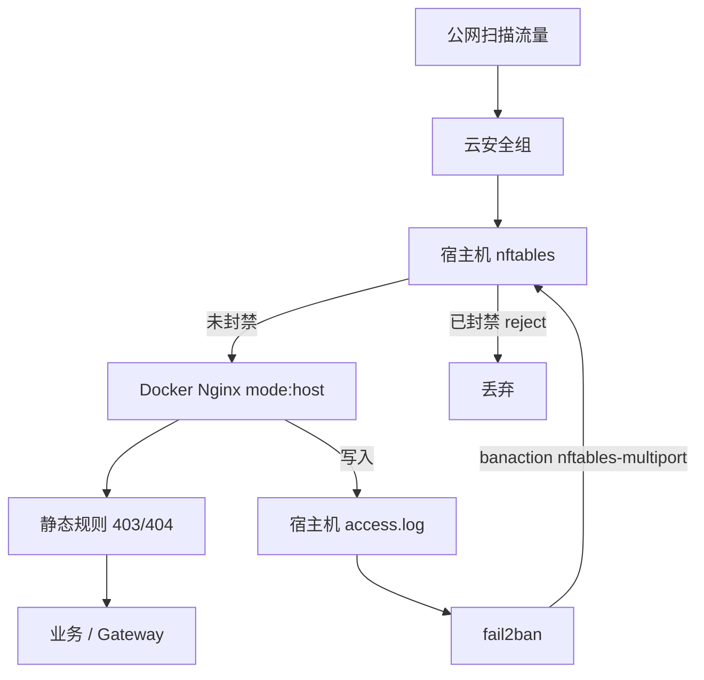

<!-- toc -->

# <span id="inline-blue">概述</span>

Docker 部署的 Nginx / 反向代理入口长期暴露在公网时，`access.log` 里往往充斥 `.env`、`.git`、Nmap、路径穿越等扫描请求。仅靠 Nginx 静态 `deny` / 路径拦截能挡单次探测，却无法自动封禁反复扫描的源 IP，日志噪音与带宽消耗仍会持续。

本文介绍在 Ubuntu 22.04 宿主机安装 fail2ban，读取 Docker 挂载到宿主机的 Nginx `access.log`，结合系统默认 nftables 自动封禁恶意扫描 IP 的做法。方案适用于阿里云 Docker Swarm 双入口（管理后台 / API）场景。

| 项 | 说明 |
|----|------|
| 目标 | 恶意扫描 IP 自动封禁，降低 access.log 噪音 |
| 系统 | Ubuntu 22.04 LTS |
| 组件 | fail2ban + nftables；Docker Nginx（端口 `mode: host`） |
| 日志 | 宿主机绝对路径下的 `access.log` |
| 不依赖 | ufw；无需改造 Nginx 镜像 |

**环境示例：**

| 角色 | 示例 |
|------|------|
| 管理入口节点（base） | 私网 `<vpc-base-ip>`，日志 `/usr/local/<app>/nginx/logs/access.log` |
| API 入口节点（interface） | 私网 `<vpc-interface-ip>`，日志 `/usr/local/<app>/emqx_nginx/logs/access.log` |
| 办公网出口（白名单） | `<office-egress-ip>` |
| 管理入口 | `https://<admin-host>` |
| API 入口 | `https://<api-host>` |

# <span id="inline-blue">架构说明</span>



| 原则 | 说明 |
|------|------|
| 宿主机安装 | fail2ban 直接改本机 nftables，与 `mode: host` 发布端口匹配 |
| 分节点部署 | 管理入口、API 入口各装一份；日志不在同一机，不做跨节点共享 |
| 不开 ufw | 避免与 Docker 规则冲突；外层用云安全组即可 |
| 匹配扫描特征 | 禁止对全部 404 计次，避免误封业务 API |

# <span id="inline-blue">环境要求</span>

| 项 | 要求 |
|----|------|
| OS | Ubuntu 22.04（系统默认 nftables） |
| Docker Nginx | `access.log` 已 bind mount 到宿主机目录 |
| 端口模式 | 建议 `published` 使用 `mode: host` |
| 权限 | root 或具备 sudo |
| 网络 | 已知 VPC 私网段、Docker bridge 段、办公出口公网 IP |

**日志挂载关系：**

```text
Nginx 容器内  /var/log/nginx/access.log
        ↕ bind mount
宿主机        /usr/local/<app>/nginx/logs/access.log
        ↑
fail2ban 只读这一侧绝对路径
```

**日志格式（`log_format main`）：**

```text
$remote_addr - $remote_user [$time_local] "$request" $status ...
```

典型恶意请求示例：

```text
<scanner-ip> - - [24/Jul/2026:07:20:40 +0000] "GET /.env HTTP/1.1" 404 153 "-" "..." "-"
<scanner-ip> - - [24/Jul/2026:08:27:29 +0000] "GET /HNAP1 HTTP/1.1" 404 153 "-" "Nmap Scripting Engine" "-"
```

# <span id="inline-blue">核心步骤</span>

## 确认宿主机日志可读

```bash
# 管理入口节点
ls -l /usr/local/<app>/nginx/logs/access.log
tail -n 5 /usr/local/<app>/nginx/logs/access.log

# API 入口节点
ls -l /usr/local/<app>/emqx_nginx/logs/access.log
tail -n 5 /usr/local/<app>/emqx_nginx/logs/access.log
```

| 检查项 | 期望 |
|--------|------|
| 文件存在 | `access.log` 持续增长 |
| 行首 IP | 公网访问为公网源 IP（无 SLB 时） |

## 安装 fail2ban

两台入口机均执行：

```bash
sudo apt-get update
sudo apt-get install -y fail2ban
sudo systemctl enable fail2ban
```

**安全要求：** 不要仅为 fail2ban 开启 ufw。

## 编写 filter

创建 `/etc/fail2ban/filter.d/nginx-scan.conf`：

```ini
[Definition]
# 只匹配扫描特征 URI / 恶意 UA，勿匹配全部 404
failregex = ^<HOST> - \S+ \[\]?[^]]*\] "(GET|POST|HEAD|PUT|DELETE|PROPFIND|OPTIONS)[^\"]*(?:/\.env(?:\.[a-zA-Z0-9_-]+)?(?:/|$|\?)|/\.git(?:/|$|\?)|/phpunit|/vendor/phpunit|/wp-admin|/wp-login|/phpmyadmin|/xmlrpc\.php|/wlwmanifest|/cgi-bin/|/HNAP1|/evox/about|/sdk(?:/|$|\?)|/nmaplowercheck|/actuator|/solr/|/console/|/manager/html|\.php(?:\?|$| ))[^\"]*" (400|403|404|405)
            ^<HOST> - \S+ \[\]?[^]]*\] "[^\"]*" (400|403|404|405) "[^\"]*" "[^\"]*(?:Nmap Scripting Engine|FreePBX-Scanner|nvdorz|zgrab|masscan|sqlmap)[^\"]*"

# 仅排除业务版 API 的 404；切勿写成 /api/（会误忽略 /api/.env）
ignoreregex = ^<HOST> - \S+ \[\]?[^]]*\] "(GET|POST|HEAD) /api/v[0-9]+/[^\"]*" (404)
```

| 匹配类型 | 示例 |
|----------|------|
| 敏感文件 | `/.env`、`/.git/config` |
| 路径穿越 | `/cgi-bin/.%2e/.../bin/sh` |
| 设备扫描 | `/HNAP1`、`nmaplowercheck*` |
| 扫描器 UA | Nmap、sqlmap、masscan |

## 编写 jail

**管理入口** `/etc/fail2ban/jail.d/nginx-admin.local`：

```ini
[nginx-admin]
enabled   = true
filter    = nginx-scan
logpath   = /usr/local/<app>/nginx/logs/access.log
backend   = auto
port      = 80,443,8080,8001,18083,8182,9412,9444
protocol  = tcp
banaction = nftables-multiport
findtime  = 10m
maxretry  = 8
bantime   = 12h
ignoreip  = 127.0.0.1/8 ::1
            10.0.0.0/8 172.16.0.0/12 192.168.0.0/16
            172.17.0.0/16 172.18.0.0/16
            <vpc-cidr>
            <office-egress-ip>
```

**API 入口** `/etc/fail2ban/jail.d/nginx-api.local`：

```ini
[nginx-api]
enabled   = true
filter    = nginx-scan
logpath   = /usr/local/<app>/emqx_nginx/logs/access.log
backend   = auto
port      = 80,443,8001,8085,8884
protocol  = tcp
banaction = nftables-multiport
findtime  = 10m
maxretry  = 8
bantime   = 12h
ignoreip  = 127.0.0.1/8 ::1
            10.0.0.0/8 172.16.0.0/12 192.168.0.0/16
            172.17.0.0/16 172.18.0.0/16
            <vpc-cidr>
            <office-egress-ip>
```

| 参数 | 含义 |
|------|------|
| `findtime` | 统计窗口 |
| `maxretry` | 窗口内命中次数达到后封禁 |
| `bantime` | 封禁时长 |
| `ignoreip` | 永不封禁的地址（本机、VPC、Docker、办公出口） |
| `banaction` | 使用 nftables multiport |
| `port` | 封禁生效的本机监听端口（按实际暴露裁剪） |

> `ignoreip` 务必包含办公出口 `<office-egress-ip>`，以及 `docker0`（`172.17.0.0/16`）、`docker_gwbridge`（`172.18.0.0/16`）、VPC 私网段。

## 校验正则

```bash
sudo fail2ban-regex /usr/local/<app>/nginx/logs/access.log \
  /etc/fail2ban/filter.d/nginx-scan.conf
```

| 期望 | 说明 |
|------|------|
| Failregex 有较多命中 | `.env` / `.git` / HNAP 等能匹配 |
| Ignored 中无 `/api/.env` | `ignoreregex` 未过宽 |
| 业务 `/api/v5/...` 404 | 可被 ignore，或不计入 fail |

## 启动服务

```bash
sudo systemctl restart fail2ban
sudo fail2ban-client status
sudo fail2ban-client status nginx-admin   # 或 nginx-api
```

# <span id="inline-blue">配置与验证</span>

## 手工测封（确认 nftables 真正生效）

```bash
TEST_IP=203.0.113.10
sudo fail2ban-client set nginx-admin banip "$TEST_IP"
sudo fail2ban-client status nginx-admin

# 正确查看方式：表名为 f2b-table，set 名为 addr-set-<jail>
sudo nft list tables
sudo nft list table inet f2b-table
```

正常时类似：

```text
table inet f2b-table {
  set addr-set-nginx-admin {
    elements = { 203.0.113.10 }
  }
  chain f2b-chain {
    type filter hook input priority filter - 1; policy accept;
    tcp dport { 80, 443, ... } ip saddr @addr-set-nginx-admin reject ...
  }
}
```

测完解封：

```bash
sudo fail2ban-client set nginx-admin unbanip "$TEST_IP"
```

## 理解「regex 有命中但 status 为 0」

| 命令 | 行为 |
|------|------|
| `fail2ban-regex` | 离线扫整份历史日志 |
| 运行中 jail | 只监控启动后新写入的行，默认不回溯历史封禁 |

因此刚 `restart` 后 `Currently banned: 0` 属于正常；等新扫描写入或手工 `banip` 验证即可。

## 日常运维

| 操作 | 命令 |
|------|------|
| 查看 jail | `fail2ban-client status` |
| 查看封禁列表 | `fail2ban-client status nginx-admin` |
| 解封 | `fail2ban-client set nginx-admin unbanip <IP>` |
| 重载配置 | `fail2ban-client reload` |
| 看服务日志 | `journalctl -u fail2ban -f` |
| 看 nft 规则 | `nft list table inet f2b-table` |

# <span id="inline-blue">常见问题</span>

| 问题 | 原因 | 处理 |
|------|------|------|
| `fail2ban-regex` 把 `/api/.env` 算进 Ignored | `ignoreregex` 写成了 `/api/` | 改为仅 `/api/v[0-9]+/` |
| status 有 Banned，但 `grep f2b-<jail名>` 为空 | 规则在 `inet f2b-table` / `addr-set-<jail>` | 使用 `nft list table inet f2b-table` |
| 封禁后仍能访问 | Docker 与 nft 优先级、或 port 列表不全 | 核对 `port=`；可试 `nftables-allports` |
| 办公网被封 | 未加办公出口到 `ignoreip` | 加入 `<office-egress-ip>` 后 reload |
| 业务 API 误封 | 对全部 404 计次 | 只用扫描特征 failregex |
| 需要开 ufw 吗 | 不需要 | 安全组 + nftables 即可 |

# <span id="inline-blue">完整命令清单</span>

```bash
# ── 1. 确认日志 ──
ls -l /usr/local/<app>/nginx/logs/access.log
tail -n 5 /usr/local/<app>/nginx/logs/access.log

# ── 2. 安装 ──
sudo apt-get update
sudo apt-get install -y fail2ban
sudo systemctl enable fail2ban

# ── 3. 下发配置（自行编辑 filter / jail 后）──
sudo cp nginx-scan.conf /etc/fail2ban/filter.d/
sudo cp nginx-admin.local /etc/fail2ban/jail.d/    # 管理入口节点
# sudo cp nginx-api.local /etc/fail2ban/jail.d/    # API 入口节点

# ── 4. 校验正则 ──
sudo fail2ban-regex /usr/local/<app>/nginx/logs/access.log \
  /etc/fail2ban/filter.d/nginx-scan.conf

# ── 5. 启动 ──
sudo systemctl restart fail2ban
sudo fail2ban-client status
sudo fail2ban-client status nginx-admin

# ── 6. 测封 / 验 nft ──
TEST_IP=203.0.113.10
sudo fail2ban-client set nginx-admin banip "$TEST_IP"
sudo nft list table inet f2b-table
sudo fail2ban-client set nginx-admin unbanip "$TEST_IP"
```

完成以上配置后，可持续观察 `fail2ban-client status` 与 `access.log` 扫描噪音变化。
