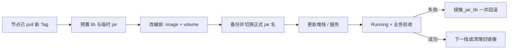
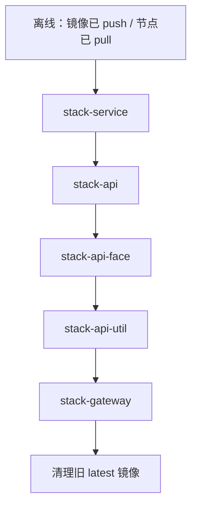

<!-- toc -->

# <span id="inline-blue">概述</span>

测试环境微服务若长期使用 `dev` 仓库的 `latest` 镜像，且宿主机只挂 FatJar，发版难追溯、切换易与运行中文件互相干扰。在 Docker Swarm 单节点 + Portainer 堆栈场景下，改为拉取带日期 Tag 的新镜像，按栈串行增加 `lib` 挂载并切换瘦 Jar：先上传 lib 与临时名 jar，再改编排、备份改名后「更新堆栈」。效果是升级窗口可控、失败可整栈回滚到旧镜像与旧挂载形态，网关放在最后以降低 `/wait` 超时概率。

| 项 | 说明 |
|----|------|
| 问题 | `latest` 难追溯；在线覆盖运行中 jar 风险高；多服务同时升增加回滚复杂度 |
| 优化 | 日期 Tag 镜像；`*_1.jar` 预上传；Portainer 改 image/volume；按栈串行升级与回滚 |
| 效果 | 短暂停服后拉起；Nacos 可重新注册；异常时镜像/jar/lib 挂载可一并还原 |
| 适用 | Swarm 单节点、`role=base`、Portainer 管理堆栈 |
| 不适用 | 多副本滚动升级未单独验证；K8s / 非 Portainer 编排需改操作面 |

**环境示例（可替换）：** 下文 `clearstream-*`、Harbor 域名、宿主机路径均为样板，落地时换成你的仓库、栈名与目录即可。

| 角色 | 示例地址 |
|------|----------|
| 集群 | Swarm 单节点，`role=base` |
| Harbor | `harbor.demo-lab.net:8443` |
| 旧镜像 | `harbor.demo-lab.net:8443/clearstream-dev/clearstream-admin-biz:latest` |
| 新镜像 | `harbor.demo-lab.net:8443/clearstream-test/clearstream-admin-biz:20260804` |
| 宿主机模块根 | `/usr/local/docker/clearstream/` |

# <span id="inline-blue">通用升级状态机</span>

与具体栈名无关的流程可抽象为：



| 阶段 | 目的 | 停机 |
|------|------|------|
| pull / 预置文件 | 新产物就位，旧进程仍跑旧包 | 通常不停服 |
| 改编排 + 切正式名 + 更新 | 切换镜像与挂载 | 单副本时短暂停服 |
| 验收 / 回滚 | 确认或整栈还原 | 回滚再次短暂停服 |

**多副本差异：** `replicas > 1` 时 Swarm 可滚动更新，窗口与单副本不同；本文样板按 `replicas: 1` 描述，扩副本前请单独演练。

# <span id="inline-blue">环境要求</span>

| 项 | 要求 |
|----|------|
| 编排 | Portainer → Stacks → Web 编辑 → 更新堆栈 |
| 运行形态（目标） | 同时挂载瘦 Jar、`lib/`、logs |
| 文件传输 | SFTP/XFTP |
| 基础组件 | MySQL / Nacos / Redis 等本次不升级 |
| 前置产物 | 节点已能 `docker pull` 到新 Tag；各模块 jar/lib 已备好且同批次 |

目录约定：

```text
/usr/local/docker/clearstream/<模块名>/
  ├── jar/          # 运行中的 *.jar；切换时临时使用 *_1.jar
  ├── lib/          # 外置依赖挂载
  └── logs/         # 已有日志挂载
```

# <span id="inline-blue">升级顺序</span>



| 顺序 | Stack | 服务 |
|------|-------|------|
| 1 | `clearstream-stack-service` | auth、admin-biz、admin-log、quartz |
| 2 | `clearstream-stack-api` | api-app、api-pad |
| 3 | `clearstream-stack-api-face` | api-face |
| 4 | `clearstream-stack-api-util` | api-util |
| 5 | `clearstream-stack-gateway` | gateway |

> gateway 放最后：其 `/wait` 依赖后端多端口。每栈验收通过后再做下一栈，降低回滚面。

# <span id="inline-blue">核心步骤</span>

## 节点确认新镜像已就绪

```bash
docker login harbor.demo-lab.net:8443
docker pull harbor.demo-lab.net:8443/clearstream-test/clearstream-admin-biz:20260804
# 其余服务同理
docker images | grep clearstream-test
```

镜像构建与推送可提前完成，**本阶段不停服**。

## 上传 lib，并以临时名上传新 jar

在点击「更新堆栈」之前完成（旧容器仍用旧包运行）：

```text
.../clearstream-admin-biz/lib/                      # 建议先清空再整目录上传
.../clearstream-admin-biz/jar/clearstream-admin-biz_1.jar
```

**不要立刻覆盖**正在挂载的正式名 `clearstream-admin-biz.jar`。

## Portainer 修改镜像与 volume

进入：**Portainer → Stacks → 目标堆栈 → Editor**

**（1）镜像改为 test 项目 + 日期 Tag**

```yaml
image: harbor.demo-lab.net:8443/clearstream-test/clearstream-admin-biz:20260804
```

**（2）增加 lib 挂载**（与现有 jar、logs 并存）

```yaml
volumes:
  - /usr/local/docker/clearstream/clearstream-admin-biz/logs/clearstream-admin-biz:/home/clearstream/logs/clearstream-admin-biz
  - /usr/local/docker/clearstream/clearstream-admin-biz/jar/clearstream-admin-biz.jar:/home/clearstream/clearstream-admin-biz.jar
  - /usr/local/docker/clearstream/clearstream-admin-biz/lib:/home/clearstream/lib
```

栈内每个服务都改完镜像与 lib 挂载。

## 宿主机备份并切换正式 jar 名

```bash
BASE=/usr/local/docker/clearstream
TS=$(date +%Y%m%d%H%M)

cp $BASE/clearstream-admin-biz/jar/clearstream-admin-biz.jar \
   $BASE/clearstream-admin-biz/jar/clearstream-admin-biz.jar.bak.$TS

mv -f $BASE/clearstream-admin-biz/jar/clearstream-admin-biz_1.jar \
      $BASE/clearstream-admin-biz/jar/clearstream-admin-biz.jar
```

栈内其余服务同样：备份 → `_1.jar` 改名为挂载名 → 在 Portainer 点击 **更新堆栈**。

单节点 + `replicas: 1` 时，该栈会短暂停服后拉起，窗口主要为应用启动时间。

## 回滚

镜像、jar、lib 挂载三者一起回到升级前：

```bash
cp /usr/local/docker/clearstream/clearstream-admin-biz/jar/clearstream-admin-biz.jar.bak.202608041200 \
   /usr/local/docker/clearstream/clearstream-admin-biz/jar/clearstream-admin-biz.jar
```

```yaml
image: harbor.demo-lab.net:8443/clearstream-dev/clearstream-admin-biz:latest
# 删除或注释 lib 挂载行，恢复仅 jar + logs
```

改完后再次「更新堆栈」。同栈多服务异常时建议整栈回滚，避免新旧形态混跑。

## 成功后清理与规范

```bash
docker images | grep clearstream-dev
docker rmi harbor.demo-lab.net:8443/clearstream-dev/clearstream-admin-biz:latest
# 确认无引用后再删其余旧镜像
```

| 项 | 规范 |
|----|------|
| Harbor 项目 | 测试环境统一 `clearstream-test` |
| Tag | 统一日期；禁止再以 `clearstream-dev/...:latest` 作为测试运行镜像 |
| 仅改业务 | lib 未变时可只换 jar 并更新堆栈 |
| 依赖变更 | 必须同步更新 lib，并视情况重建镜像 |

# <span id="inline-blue">验证</span>


| 检查项 | 预期 |
|--------|------|
| Portainer | 对应 Stack 服务 Running / 1/1 |
| 日志 | `/wait` 通过；应用启动成功；无 `ClassNotFoundException` |
| Nacos | 实例重新注册且健康 |
| 业务 | 管理后台可登录；本栈相关接口可访问 |
| 全量完成 | 经 gateway 端到端访问通过 |

```bash
docker service logs clearstream-stack-service_clearstream-admin-biz --tail 100
```

验收以 Portainer / `docker service ls` 状态全部为 Running 为准。

# <span id="inline-blue">常见问题</span>

| 问题 | 原因 | 处理 |
|------|------|------|
| `ClassNotFoundException` / 启动异常 | 未挂 lib，或 jar/lib 不同批次 | 核对 volume；用同一次构建产物 |
| gateway 卡在 `/wait` | 后端未就绪就更新 gateway | 前四栈均 Running 后再升 gateway |
| 中间状态业务异常 | 先改挂载文件名、后改堆栈不一致 | 严格：先传 `_1.jar` → 改 Portainer → 备份改名 → 更新堆栈 |
| 多栈同时点更新 | 回滚面过大 | **按栈串行** |
| `docker rmi` 提示占用 | 仍有服务引用旧镜像 | 确认无引用后再删，或谨慎 `docker image prune` |

# <span id="inline-blue">完整命令清单</span>

```bash
# ── 1. 节点拉取（示例） ──
docker login harbor.demo-lab.net:8443
docker pull harbor.demo-lab.net:8443/clearstream-test/clearstream-admin-biz:20260804
docker images | grep clearstream-test

# ── 2. 切换前备份并覆盖正式 jar 名（lib 已用 SFTP 传好） ──
BASE=/usr/local/docker/clearstream
TS=$(date +%Y%m%d%H%M)
cp $BASE/clearstream-admin-biz/jar/clearstream-admin-biz.jar \
   $BASE/clearstream-admin-biz/jar/clearstream-admin-biz.jar.bak.$TS
mv -f $BASE/clearstream-admin-biz/jar/clearstream-admin-biz_1.jar \
      $BASE/clearstream-admin-biz/jar/clearstream-admin-biz.jar

# ── 3. 验收日志 ──
docker service logs clearstream-stack-service_clearstream-admin-biz --tail 100

# ── 4. 稳定后清理旧 latest（确认无引用） ──
docker rmi harbor.demo-lab.net:8443/clearstream-dev/clearstream-admin-biz:latest
```

# <span id="inline-blue">小结</span>

1. **通用状态机**是 pull → 预置 → 改编排 → 切正式名 → 更新 → 验收/回滚；栈名与路径只是环境示例。  
2. **单副本短暂停服**可接受时按栈串行；gateway 放最后，降低 `/wait` 失败面。  
3. 回滚必须 **镜像 + jar + lib 挂载** 一并还原，避免新旧形态混跑。

按「节点 pull → 备好 lib 与 `*_1.jar` → Portainer 改镜像并加 lib → 备份改名 → 更新堆栈 → 验收」逐栈完成后，即可在同类 Swarm 测试环境复用该升级方式。
