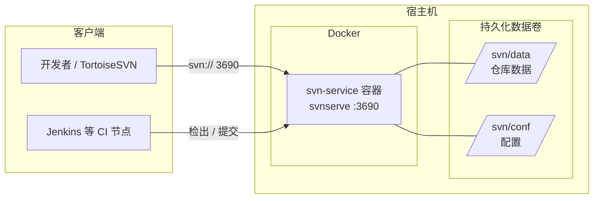

<!-- toc -->

# <span id="inline-blue">概述</span>

| 项 | 说明 |
|----|------|
| 镜像 | `garethflowers/svn-server:latest`（Alpine + `svnserve`，体积约 18MB） |
| 协议 | `svn://`（svnserve 守护进程，默认端口 3690） |
| 编排文件 | `docker-compose-svn.yml` |

SVN 服务以单容器方式运行 `svnserve` 守护进程，所有仓库数据与配置通过数据卷挂载到宿主机持久化，开发者使用 SVN 客户端通过 `svn://` 协议访问。

# <span id="inline-blue">部署架构</span>



## 镜像说明

| 项 | 值 |
|----|----|
| 镜像 | `garethflowers/svn-server:latest` |
| 启动命令 | `svnserve --daemon --foreground --root /var/opt/svn` |
| 仓库根目录（容器内） | `/var/opt/svn` |
| 暴露端口 | `3690/tcp` |
| 健康检查 | 监听 3690 端口存活检测 |

> 该镜像将所有仓库统一存放在容器内的 `/var/opt/svn`，每个仓库为其下的一个子目录。本部署额外挂载 `/var/svn/config` 作为全局用户 / 权限配置目录，各仓库的 `svnserve.conf` 统一指向其中的 `passwd`、`authz`（详见权限配置一节）。

# <span id="inline-blue">环境要求</span>

| 项 | 建议 |
|----|------|
| CPU | 1 核及以上 |
| 内存 | 1 GB 及以上 |
| 磁盘 | 按代码仓库规模规划，建议 50 GB+ |
| 系统 | 任意支持 Docker 的 Linux 发行版 |
| 依赖 | Docker 20.x+、Docker Compose |

```bash
docker version
docker compose version   # 或 docker-compose version
```

# <span id="inline-blue">编排文件</span>

`docker-compose-svn.yml`：

```yaml
version: '3.0'
services:
  svn-service:
    image: garethflowers/svn-server:latest
    container_name: svn-service
    restart: always
    privileged: true
    ports:
      - '3690:3690'
    volumes:
      - '/usr/local/docker/svn/data/:/var/opt/svn/'
      - '/usr/local/docker/svn/conf:/var/svn/config'
    networks:
      - svn-network
networks:
  svn-network:
    external: false
    driver: bridge
```

字段说明：

| 字段 | 说明 |
|------|------|
| `image` | SVN 服务镜像 |
| `container_name` | 容器名，后续 `docker exec` 使用 |
| `restart: always` | 宿主机重启 / 容器异常退出后自动拉起 |
| `privileged: true` | 特权模式，避免文件权限相关问题 |
| `ports` | `宿主机端口:容器端口`，对外暴露 3690 |
| `volumes` 第 1 条 | 仓库数据持久化：宿主机 `…/svn/data` ↔ 容器 `/var/opt/svn` |
| `volumes` 第 2 条 | **全局用户 / 权限配置**：宿主机 `…/svn/conf` ↔ 容器 `/var/svn/config` |
| `networks` | 独立 bridge 网络，便于与其它服务隔离 |

> **本部署采用全局配置方式**：用户账号（`passwd`）与权限规则（`authz`）统一存放在第 2 条数据卷（`/var/svn/config`）中，所有仓库共用同一套账号与权限；各仓库 `svnadmin create` 时在自身 `conf/` 下生成的配置仅作为项目自身配置，通过让其 `svnserve.conf` 指向全局文件来生效。
>
> **数据持久化关键点**：仓库数据在 `…/svn/data`、全局配置在 `…/svn/conf`，删除容器均不丢失。请同时备份这两个宿主机目录。

# <span id="inline-blue">目录规划</span>

宿主机目录（与编排文件中的挂载路径对应）：

```
/usr/local/docker/svn/
├── data/                        # 挂载到容器 /var/opt/svn（仓库根目录）
│   └── <仓库名>/                # svnadmin create 生成的仓库
│       ├── conf/
│       │   ├── svnserve.conf    # 仓库访问策略（指向全局 passwd / authz）
│       │   ├── passwd           # 项目自身用户文件（全局模式下不使用）
│       │   └── authz            # 项目自身权限文件（全局模式下不使用）
│       ├── db/                  # 版本数据
│       ├── hooks/               # 钩子脚本
│       └── ...
└── conf/                        # 挂载到容器 /var/svn/config（全局配置）
    ├── passwd                   # 全局用户名 / 密码（所有仓库共用）
    └── authz                    # 全局用户组与目录权限（所有仓库共用）
```

```bash
mkdir -p /usr/local/docker/svn/data
mkdir -p /usr/local/docker/svn/conf
```

# <span id="inline-blue">启动服务</span>

在编排文件所在目录执行：

```bash
docker compose -f docker-compose-svn.yml up -d
```

查看运行状态与日志：

```bash
docker ps | grep svn-service
docker logs -f svn-service
```

停止 / 重启：

```bash
docker compose -f docker-compose-svn.yml down      # 停止并删除容器（数据保留）
docker compose -f docker-compose-svn.yml down -v   # 停止并删除容器，同时清理对应容器挂载的数据卷
docker restart svn-service                         # 重启容器
```

> **谨慎使用 `down -v`**：该命令会在停止并删除容器的同时清理对应挂载的数据卷。请在确认仓库数据已备份后再执行，避免误删导致代码仓库丢失。

# <span id="inline-blue">创建仓库</span>

通过 `svnadmin` 在容器内创建仓库（以仓库名 `<项目名>` 为例）：

```bash
docker exec -it svn-service svnadmin create <项目名>
```

执行后会在宿主机 `/usr/local/docker/svn/data/<项目名>/` 下生成完整仓库结构。可在宿主机直接编辑其配置文件，无需进入容器。

> 一个 SVN 服务可创建多个仓库，重复执行 `svnadmin create <仓库名>` 即可。

# <span id="inline-blue">权限配置</span>

本部署将用户与权限**统一存放在全局配置目录**，所有仓库共用。涉及两类文件：

- **全局配置**（宿主机 `/usr/local/docker/svn/conf`，对应容器 `/var/svn/config`）：`passwd`、`authz`，所有仓库共用。
- **仓库 `svnserve.conf`**（位于各仓库 `…/data/<仓库名>/conf/svnserve.conf`）：负责将本仓库的认证 / 鉴权指向上述全局文件。

## 仓库 svnserve.conf

编辑仓库的 `svnserve.conf`（路径 `…/data/<项目名>/conf/svnserve.conf`），去掉注释并将 `password-db`、`authz-db` 指向全局文件（**行首不能有空格**）：

```ini
[general]
anon-access = none                       # 匿名用户无权限
auth-access = write                      # 认证用户可读写
password-db = /var/svn/config/passwd     # 指向全局用户文件
authz-db = /var/svn/config/authz         # 指向全局权限文件
realm = <项目名>                          # 认证域，多仓库建议统一，便于凭据缓存
```

> 每新建一个仓库，都需将其 `svnserve.conf` 的 `password-db` / `authz-db` 指向上述全局路径，即可复用同一套账号与权限。

## 全局 passwd

编辑全局用户文件 `/usr/local/docker/svn/conf/passwd`，在 `[users]` 段下按 `用户名 = 密码` 配置（行首不留空格，此处为脱敏示例）：

```ini
[users]
admin = <在此填写管理员密码>
developer = <在此填写开发者密码>
```

> **安全提醒**：`passwd` 文件中密码为明文存储，请勿提交到任何代码仓库；生产环境建议配合操作系统权限限制该文件读取，并使用强密码。

## 全局 authz

编辑全局权限文件 `/usr/local/docker/svn/conf/authz`：

```ini
[groups]
dev-team = developer

# 按 仓库名:/ 路径 配置各仓库权限，所有仓库共用同一份 authz
[<项目名>:/]
admin = rw
@dev-team = rw
* =                      # 其它用户无权限

# 新增仓库时在此追加对应小节，例如：
# [other-repo:/]
# admin = rw
```

权限取值：`rw`（读写）、`r`（只读）、空（无权限）。

> 修改 `svnserve.conf` / 全局 `passwd` / 全局 `authz` 后**通常即时生效**（svnserve 按需读取）；如遇缓存导致不生效，可执行 `docker restart svn-service`。

# <span id="inline-blue">客户端访问</span>

仓库访问地址格式：

```
svn://<服务器IP>/<仓库名>
```

示例（请替换为实际服务器 IP）：

```
svn://<SVN服务器IP>/<项目名>
```

命令行检出：

```bash
svn checkout svn://<SVN服务器IP>/<项目名> --username developer
# 按提示输入密码
```

Windows 端可使用 TortoiseSVN：右键 *SVN Checkout* → 填写上述 URL → 输入账号密码。

# <span id="inline-blue">备份与恢复</span>

## 备份

直接备份宿主机数据目录即可：

```bash
tar -zcvf svn-backup-$(date +%F).tar.gz /usr/local/docker/svn/data
```

或使用 `svnadmin dump` 做逻辑备份（便于跨版本迁移）：

```bash
docker exec svn-service svnadmin dump <项目名> > <项目名>-$(date +%F).dump
```

## 恢复

```bash
# 物理恢复：还原 data 目录后重启容器
tar -zxvf svn-backup-xxxx.tar.gz -C /

# 逻辑恢复：先创建空仓库再 load
docker exec -it svn-service svnadmin create <项目名>
docker exec -i svn-service svnadmin load <项目名> < <项目名>-xxxx.dump
```

# <span id="inline-blue">与 Jenkins CI 联动</span>

代码仓库供 Jenkins 流水线检出、构建并推送镜像至 Harbor。

## 仓库访问地址

```
svn://<SVN服务器IP>/<项目名>
```

- 仓库为 **项目根目录**（非 `trunk` 子路径）
- Jenkins 节点需能访问 SVN 服务器 `<SVN服务器IP>:3690`

## Jenkins 侧配置摘要

| 项 | 说明 |
|----|------|
| 任务 SCM URL | 与上节仓库地址一致 |
| Jenkins 凭据 ID | `SVN-<项目名>`（在 Jenkins Credentials 中配置，**勿写入 SVN**） |
| 流水线文件 | 仓库根目录 `Jenkinsfile` |
| 触发方式 | Poll SCM 或 post-commit Hook（任务名 `<Pipeline任务名>`） |

## post-commit Hook

在 SVN 服务器 `/var/opt/svn/<项目名>/hooks/post-commit` 中配置（由 `post-commit.tmpl` 复制并改名，**勿直接改 `.tmpl`**）：

```bash
#!/bin/sh
REPOS="$1"
REV="$2"

JENKINS_URL="http://<Jenkins节点IP>:<HTTP端口>"
JENKINS_USER="<Jenkins用户名>"
JENKINS_API_TOKEN="<Jenkins API Token>"
JOB_NAME="<Pipeline任务名>"
BUILD_TOKEN="<Remote触发Token>"

/usr/bin/curl -s -u "${JENKINS_USER}:${JENKINS_API_TOKEN}" \
  "${JENKINS_URL}/job/${JOB_NAME}/buildWithParameters?token=${BUILD_TOKEN}&SERVICE=all&HARBOR_PROJECT=<Harbor项目名-test>" \
  > /dev/null 2>&1 &

exit 0
```

```bash
chmod +x /var/opt/svn/<项目名>/hooks/post-commit
```

Jenkins 任务侧须勾选 **Trigger builds remotely**，Authentication Token 填 `<Remote触发Token>`（与 `BUILD_TOKEN` 一致）。

> Hook 使用 Jenkins **API Token** 认证，不要使用登录密码。Token 在 Jenkins 用户设置中生成，**勿写入 SVN 仓库、勿提交到文档**；若已泄露须立即撤销并重新生成。

## post-commit 依赖 curl

官方 `garethflowers/svn-server` 为 Alpine 极简镜像，**默认无 `curl`**。容器内执行 `curl: not found` 时，Hook 会静默失败（脚本里输出重定向到 `/dev/null`），提交成功但 Jenkins 不会构建。

**临时修复（当前容器，重建后会丢失）：**

```bash
docker exec -it svn-service /bin/sh
apk add --no-cache curl
curl --version
exit
```

**持久修复（推荐）：** 使用项目 `docker/svn/Dockerfile` 构建带 curl 的镜像，并更新 compose：

```bash
cd docker
docker compose -f docker-compose-svn.yml build
docker compose -f docker-compose-svn.yml up -d
```

**在容器内验证 Jenkins 连通（不要用外网域名测试）：**

```bash
docker exec -it svn-service /bin/sh
curl -s -o /dev/null -w "%{http_code}\n" \
  -u "<Jenkins用户名>:<API Token>" \
  "http://<Jenkins节点IP>:<HTTP端口>/job/<Pipeline任务名>/buildWithParameters?token=<Remote触发Token>&SERVICE=all&HARBOR_PROJECT=<Harbor项目名-test>"
```

返回 `201` 或 `302` 表示触发成功。再执行一次 SVN 提交验证 Hook。

**调试 Hook 失败时**，可临时将 post-commit 末尾改为写日志（勿长期保留 Token）：

```bash
/usr/bin/curl -s -u "${JENKINS_USER}:${JENKINS_API_TOKEN}" \
  "${JENKINS_URL}/job/${JOB_NAME}/buildWithParameters?token=${BUILD_TOKEN}&SERVICE=all&HARBOR_PROJECT=<Harbor项目名-test>" \
  >> /var/opt/svn/hook-jenkins.log 2>&1 &
```

## 网络要求

| 源 | 目标 | 端口 | 用途 |
|----|------|------|------|
| Jenkins 节点 | SVN 服务器 | 3690 | 代码检出、轮询变更 |
| SVN 服务器 | Jenkins | `<HTTP端口>` | post-commit Hook 触发构建 |
| 开发者 | SVN 服务器 | 3690 | 日常提交 |

详细流水线配置见 [Jenkins流水线配置说明](./Jenkins流水线配置说明.md)。

# <span id="inline-blue">常见问题</span>

| 现象 | 排查方向 |
|------|----------|
| 客户端连接超时 | 检查宿主机 3690 端口是否放行（防火墙 / 安全组），容器是否运行 |
| `Authorization failed` | 检查 `svnserve.conf` 注释是否去除、`passwd` 用户是否存在、`authz` 是否授权 |
| 配置改了不生效 | 确认行首无空格；必要时 `docker restart svn-service` |
| 提交大文件失败 | 检查磁盘空间与网络稳定性 |
| 容器重建后数据丢失 | 确认 `/var/opt/svn` 数据卷挂载路径正确且未被覆盖 |

# <span id="inline-blue">常用命令速查</span>

```bash
# 启动 / 停止
docker compose -f docker-compose-svn.yml up -d
docker compose -f docker-compose-svn.yml down

# 进入容器
docker exec -it svn-service /bin/sh

# 创建仓库
docker exec -it svn-service svnadmin create <仓库名>

# 查看仓库列表（宿主机）
ls /usr/local/docker/svn/data

# 查看日志
docker logs -f svn-service
```

> 本文中的 IP、用户名、Token、仓库名等均为示例或占位符；**账号密码、API Token 仅配置在 Jenkins/SVN 凭据中，勿写入仓库或文档。**
