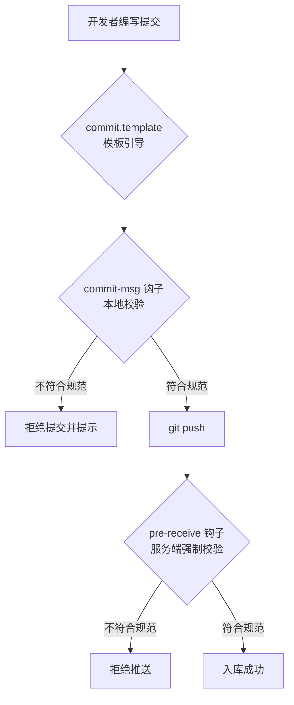

---

title: Git项目源代码提交规范  
categories:  
	- Git  
tags:  
	- Git  
	- Conventional Commits  
	- Git Hooks

## date: 2026-07-13 18:09:08

updated: 2026-07-13 18:09:08

# 概述

本文介绍如何为一个 Java / Maven 多模块项目落地统一的 Git 源代码提交规范，使所有协作者的提交信息保持一致、可读、可追溯。方案基于 [Conventional Commits](https://www.conventionalcommits.org/)，采用**纯 Git、零第三方依赖**的实现：仅用 Git 原生的提交模板（`commit.template`）与仓库内钩子（`core.hooksPath`），不依赖 Node.js、husky、commitlint，也不依赖 CI，适合后端团队直接移植。

本文可移植的完整部署方案参见 [git-commit-convention](./docs/git-commit-convention.md)。文中涉及的服务器地址、仓库名、人员信息均已脱敏。


| 项    | 说明                                     |
| ---- | -------------------------------------- |
| 规范标准 | Conventional Commits                   |
| 依赖   | 仅 Git（无 Node.js / CI）                  |
| 校验时机 | 本地 `commit-msg` 钩子；可选服务端 `pre-receive` |
| 适用项目 | Java / Maven 等后端多模块工程                  |
| 分发方式 | 钩子随仓库分发，`core.hooksPath` 指向仓库内目录       |


**环境示例：**


| 角色       | 示例地址                                  |
| -------- | ------------------------------------- |
| Git 远程仓库 | `ssh://<git-host>/<group>/<repo>.git` |
| 本地工作副本   | `<repo-root>`                         |


# 方案原理

规范落地分为三层：模板引导、本地校验、服务端强制。前两层随仓库分发、克隆后一键启用；第三层用于需要「绝对无法绕过」的场景。


| 机制                                 | 作用             | 是否强制    | 是否可绕过               |
| ---------------------------------- | -------------- | ------- | ------------------- |
| `commit.template` 提交模板             | 打开编辑器时预填格式提示   | 否（仅引导）  | —                   |
| `core.hooksPath` + `commit-msg` 钩子 | 提交时本地校验信息格式    | 是（本地）   | 可用 `--no-verify` 绕过 |
| 一键初始化脚本                            | 克隆后一条命令完成配置    | —       | —                   |
| 服务端 `pre-receive` 钩子（可选）           | push 时在服务器强制校验 | 是（真正强制） | 不可绕过                |





> `core.hooksPath` 本身是本地配置，Git 不会自动为克隆者启用，因此必须提供初始化脚本执行一次。

# 提交信息格式

采用 Conventional Commits：

```
<type>(<scope>): <subject>

[可选正文，每条要点以 "- " 开头]

[可选页脚，如 BREAKING CHANGE / 关联单号]
```

## type 枚举


| type     | 含义              |
| -------- | --------------- |
| feat     | 新增功能            |
| fix      | 修复 bug          |
| docs     | 文档、注释变更         |
| style    | 代码格式（不影响运行的变动）  |
| refactor | 重构（非新功能、非修 bug） |
| perf     | 性能优化            |
| test     | 增加或修改测试         |
| chore    | 构建过程或辅助工具变动     |
| build    | 打包、依赖变更         |
| revert   | 回退提交            |


## scope 与硬性要求

`scope` 按模块划分，例如 `gateway`、`auth`、`api-app`、`quartz`、`common`、`docker` 等，可按项目实际模块调整。

硬性要求：

- 冒号 `:` 后必须有一个空格
- `subject` 使用祈使句、简洁描述，长度 ≤ 72 字符，结尾不加句号
- `subject` 含两个以上要点时，用正文的 `-` 列表逐条说明

**正确示例：**

```
feat(gateway): 添加灰度发布过滤器

- 支持按请求 header 路由到灰度实例
- 更新网关配置文档
```

# 核心步骤

方案涉及以下文件，均可直接复制到其他项目：

```
仓库根目录/
├── .gitmessage                 # 提交模板
├── .githooks/
│   └── commit-msg              # 提交信息校验钩子
└── scripts/
    └── setup-git-hooks.sh      # 一键初始化脚本
```

## 步骤一：创建提交模板 `.gitmessage`

```text
# <type>(<scope>): <subject>   （冒号后有空格，subject ≤ 72 字符）
#
# type:  feat|fix|docs|style|refactor|perf|test|chore|build|revert
# scope: gateway|auth|api-app|quartz|common|docker ...（按模块）
#
# 示例：
#   feat(gateway): 添加灰度发布过滤器
#
#   - 支持按请求 header 路由到灰度实例
#   - 更新网关配置文档
#
# 提示：以 # 开头的行会被 Git 忽略；请在本行下方填写正式提交信息。
```

## 步骤二：创建校验钩子 `.githooks/commit-msg`

```sh
#!/bin/sh
# 校验提交信息是否符合 Conventional Commits 规范
# 通过 core.hooksPath 生效，随仓库分发。

commit_msg_file="$1"
# 取第一行非注释、非空内容作为标题行
subject_line=$(grep -vE '^\s*#' "$commit_msg_file" | grep -vE '^\s*$' | head -n1)

# 放行 merge / revert / fixup / squash 等自动生成的提交
case "$subject_line" in
  "Merge "*|"Revert "*|"fixup! "*|"squash! "*)
    exit 0
    ;;
esac

# Conventional Commits 正则
pattern='^(feat|fix|docs|style|refactor|perf|test|chore|build|revert)(\([a-z0-9._-]+\))?!?: .{1,72}$'

if printf '%s' "$subject_line" | grep -qE "$pattern"; then
  exit 0
fi

echo "------------------------------------------------------------"
echo "[提交被拒绝] 提交信息不符合规范。"
echo "格式：<type>(<scope>): <subject>   （冒号后需空格，subject ≤ 72 字符）"
echo "type：feat|fix|docs|style|refactor|perf|test|chore|build|revert"
echo "当前标题：$subject_line"
echo "示例：feat(gateway): 添加灰度发布过滤器"
echo "（如确需跳过校验：git commit --no-verify，请勿对受保护分支使用）"
echo "------------------------------------------------------------"
exit 1
```

## 步骤三：创建一键初始化脚本 `scripts/setup-git-hooks.sh`

```sh
#!/bin/sh
# 克隆仓库后执行一次即可：
#   sh scripts/setup-git-hooks.sh
set -e

repo_root=$(git rev-parse --show-toplevel)
cd "$repo_root"

# 1. 启用仓库内钩子目录（仅作用于当前仓库，不影响全局）
git config core.hooksPath .githooks

# 2. 设置提交模板
git config commit.template .gitmessage

# 3. 赋予钩子可执行权限
chmod +x .githooks/* 2>/dev/null || true

echo "Git 提交规范已配置完成："
echo "  - core.hooksPath = .githooks"
echo "  - commit.template = .gitmessage"
```

## 步骤四：本地启用

```bash
# 赋予可执行权限
chmod +x .githooks/commit-msg scripts/setup-git-hooks.sh

# 执行一次初始化（克隆后每人执行一次）
sh scripts/setup-git-hooks.sh
```


| 命令                                       | 含义                           |
| ---------------------------------------- | ---------------------------- |
| `git config core.hooksPath .githooks`    | 将钩子目录指向仓库内 `.githooks`，随仓库分发 |
| `git config commit.template .gitmessage` | 设置提交模板，编辑器打开时预填格式提示          |
| `chmod +x`                               | 赋予钩子与脚本可执行权限                 |


> Windows 用户使用 Git Bash 执行 `sh scripts/setup-git-hooks.sh`；并确保钩子文件为 LF 换行（可在 `.gitattributes` 中加 `*.sh text eol=lf`、`.githooks/* text eol=lf`）。

# 配置与验证

```bash
# 查看当前仓库配置
git config --get core.hooksPath      # 应输出 .githooks
git config --get commit.template     # 应输出 .gitmessage

# 反例：应被拒绝
git commit --allow-empty -m "更新了一些东西"

# 正例：应通过
git commit --allow-empty -m "docs(readme): 补充开发规范说明"
```

# 服务端强制校验（可选）

本地钩子可被 `git commit --no-verify` 绕过。若要求**绝对无法绕过**，需在 Git 服务器上部署同款逻辑的 `pre-receive` 钩子，在推送时校验，任何客户端都无法跳过。

```sh
#!/bin/sh
pattern='^(feat|fix|docs|style|refactor|perf|test|chore|build|revert)(\([a-z0-9._-]+\))?!?: .{1,72}$'

while read old new ref; do
  # 跳过分支删除
  [ "$new" = "0000000000000000000000000000000000000000" ] && continue

  # 确定提交范围
  if [ "$old" = "0000000000000000000000000000000000000000" ]; then
    range="$new"
  else
    range="$old..$new"
  fi

  for commit in $(git rev-list "$range"); do
    subject=$(git log --format=%s -n 1 "$commit")
    case "$subject" in
      "Merge "*|"Revert "*) continue ;;
    esac
    if ! printf '%s' "$subject" | grep -qE "$pattern"; then
      echo "[推送被拒绝] 提交 ${commit} 信息不规范：$subject"
      echo "格式：<type>(<scope>): <subject>"
      exit 1
    fi
  done
done
exit 0
```

部署位置取决于服务器软件：


| 服务器软件          | 部署方式                                                                            |
| -------------- | ------------------------------------------------------------------------------- |
| 裸仓库 / Gitolite | 放入 `<repo>.git/hooks/pre-receive` 并 `chmod +x`                                  |
| Gitea          | 仓库设置 → Git Hooks → `pre-receive`，或用 Branch/Push 规则的正则校验                         |
| GitLab         | Project → Settings → Repository → Push Rules → Commit message 正则填入上面的 `pattern` |


# 常见问题


| 问题                      | 原因               | 处理                                                                       |
| ----------------------- | ---------------- | ------------------------------------------------------------------------ |
| 钩子没生效                   | 未执行初始化脚本或钩子无执行权限 | 执行 `sh scripts/setup-git-hooks.sh`，确认 `.githooks/commit-msg` 有可执行权限      |
| Windows 报权限 / 换行错误      | 钩子文件为 CRLF 换行    | 用 Git Bash 执行；在 `.gitattributes` 固定 `*.sh`、`.githooks/*` 为 `eol=lf`      |
| `set: Illegal option -` | 脚本被存成 CRLF 换行    | `sed -i 's/\r$//' scripts/setup-git-hooks.sh .githooks/commit-msg` 转为 LF |
| 需要临时跳过校验                | 特殊场景个人提交         | `git commit --no-verify`，禁止用于推送受保护分支                                     |
| 历史提交格式不统一               | 规范启用前的旧提交        | 方案仅约束新提交，不改写历史                                                           |


# 与历史提交的兼容

本方案仅约束**新提交**，不改写历史记录。旧格式保持原样，从启用之日起新提交统一采用本规范即可。旧意图到新格式的对照：


| 旧风格意图   | 新格式示例                                      |
| ------- | ------------------------------------------ |
| 新功能     | `feat(api-app): 游客登录改用 clientId 替换 email`  |
| Bug 修复  | `fix(auth): 修复微信支付公钥验签失败`                  |
| 构建 / 部署 | `build(docker): elasticsearch 挂载目录与官方镜像对齐` |
| 重构      | `refactor(common): 优化 pom 依赖加载顺序`          |


