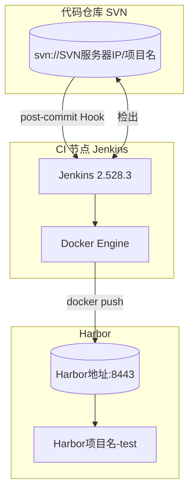

<!-- toc -->

# <span id="inline-blue">概述</span>

Jenkins 以 WAR 包独立部署于 CI 构建节点，与 SVN 代码仓库、Harbor 镜像仓库配合，为流水线提供编译与镜像构建环境。流水线触发与推送逻辑见 [Jenkins流水线配置](./Jenkins流水线配置.md)。

| 项 | 说明 |
|----|------|
| Jenkins 版本 | 2.528.3 |
| 部署方式 | WAR 包独立部署 |
| 关联文档 | [Jenkins流水线配置说明](./Jenkins流水线配置说明.md)、[SVN部署说明](./SVN部署说明.md) |

**环境示例：**

| 角色 | 示例地址 |
|------|----------|
| Jenkins | `http://<Jenkins节点IP>:<HTTP端口>`（常见 8080 或 10240，以 `start.sh` / `--httpPort` 为准） |
| SVN | `svn://<SVN服务器IP>/<项目名>` |
| Harbor | `https://<Harbor地址>:8443` |
| Harbor CI 推送项目 | `<Harbor项目名-test>`（`<Harbor项目名-dev>` 若已被其他环境占用则选用 test） |

# <span id="inline-blue">部署架构</span>

## 总体架构



## 节点内部结构

| 组件 | 路径 | 说明 |
|------|------|------|
| Jenkins 程序包 | `/home/jenkins/jenkins.war` | 升级时替换 |
| 数据目录 | `/home/jenkins/jenkins_home/` | 插件、任务、凭据、配置 |
| 进程 JDK | `/home/jenkins/jdk21` | 启动 Jenkins（OpenJDK 21） |
| 编译 JDK | `/usr/local/java/jdk8u312-b07` | Global Tool `jdk8` |
| Maven | `/home/apache-maven-3.8.9` | Global Tool `maven3` |
| 插件目录 | `jenkins_home/plugins/` | 插件持久化位置 |

## JDK 版本分工

| 用途 | 版本 | 路径 |
|------|------|------|
| Jenkins 进程启动 | OpenJDK 21.0.2 | `/home/jenkins/jdk21` |
| Maven 编译项目 | Temurin 1.8.0_312 | `/usr/local/java/jdk8u312-b07` |
| Maven 工具 | 3.8.9 | `/home/apache-maven-3.8.9` |

## 网络端口

| 方向 | 端口 | 说明 |
|------|------|------|
| 访问 Jenkins UI | 8080 或 10240 等 | 由启动参数 `--httpPort` 决定 |
| SVN → Jenkins | 同上 | post-commit Hook 调用 `buildWithParameters` |
| Jenkins → SVN | 3690 | `svn://` 协议检出与轮询 |
| Jenkins / Docker → Harbor | 8443 | HTTPS（乐此加密证书） |
| Docker → 镜像加速源 | 443 | 拉取 `eclipse-temurin` 等基础镜像 |

Harbor 使用乐此加密 HTTPS 证书，**无需**在 `daemon.json` 配置 `insecure-registries`，直接 `docker login` / `docker push` 即可。

# <span id="inline-blue">环境要求</span>

| 项 | 建议 |
|----|------|
| CPU | 4 核 |
| 内存 | 8 GB |
| 磁盘 | 100 GB+（含 Maven 仓库、Docker 镜像层） |
| 系统 | CentOS 7.x / AlmaLinux |

```bash
./java -version          # OpenJDK 21.0.2
mvn -v                   # Maven 3.8.9，Java 1.8.0_312
docker version
svn --version
```

# <span id="inline-blue">官方资源</span>

**WAR 包下载：**

- 稳定版首页：[https://get.jenkins.io/war-stable/](https://get.jenkins.io/war-stable/)
- 当前版本 2.528.3：[https://get.jenkins.io/war-stable/2.528.3/](https://get.jenkins.io/war-stable/2.528.3/)

**插件版本查询：**

- 插件中心：[https://updates.jenkins-ci.org/download/plugins/](https://updates.jenkins-ci.org/download/plugins/)

# <span id="inline-blue">目录规划</span>

```
/home/jenkins/
├── jenkins.war
├── start.sh
├── jenkins.log
├── jdk21/
└── jenkins_home/
    ├── plugins/
    ├── jobs/
    ├── credentials.xml
    ├── secrets/
    ├── config.xml
    └── .m2/
```

# <span id="inline-blue">安装与启动</span>

```bash
cd /home/jenkins
wget https://get.jenkins.io/war-stable/2.528.3/jenkins.war -O jenkins.war
mkdir -p jenkins_home
```

`start.sh` 示例（端口按实际修改，与 Hook 中 `JENKINS_URL` 一致）：

```bash
#!/bin/bash
export JENKINS_HOME=/home/jenkins/jenkins_home
export JAVA_HOME=/home/jenkins/jdk21
export PATH=$JAVA_HOME/bin:$PATH
nohup java -jar /home/jenkins/jenkins.war --httpPort=10240 --httpListenAddress=0.0.0.0 \
  >> /home/jenkins/jenkins.log 2>&1 &
```

推荐使用 systemd 托管，首次访问 `http://<节点IP>:<httpPort>`，从 `jenkins_home/secrets/initialAdminPassword` 获取初始密码。

# <span id="inline-blue">插件安装</span>

| 插件 | 用途 |
|------|------|
| Subversion Plug-in | SVN 代码检出 |
| Pipeline | 流水线 |
| Pipeline: Stage View | 阶段视图 |
| Credentials Binding | 凭据注入 |
| Maven Integration | Maven 构建 |
| JDK Tool Plugin | 全局 JDK |
| Timestamps / Workspace Cleanup / Build Timeout | 日志与构建管理 |

# <span id="inline-blue">全局工具配置</span>

路径：**Manage Jenkins → Global Tool Configuration**（取消 *Install automatically*）

| Name | 类型 | 路径 |
|------|------|------|
| `jdk8` | JDK | `/usr/local/java/jdk8u312-b07` |
| `maven3` | Maven | `/home/apache-maven-3.8.9` |

# <span id="inline-blue">Docker 与镜像构建环境</span>

Jenkins 流水线在宿主机执行 `docker build` / `docker push`，需完成以下配置。

## 权限与 Harbor 登录

```bash
# Jenkins 非 root 运行时
usermod -aG docker <jenkins运行用户>

docker login <Harbor地址>:8443 -u <Harbor用户名>
# 密码在交互提示中输入，勿写入脚本或文档
```

## Docker 镜像加速

微服务 Dockerfile 使用 `eclipse-temurin:8-jre` / `eclipse-temurin:8-jdk-jammy` 作为基础镜像。若直连 Docker Hub 或旧版阿里云加速器失败（如 `403 Forbidden`），在 **Jenkins 所在 Docker 节点** 配置 `/etc/docker/daemon.json`：

```json
{
  "registry-mirrors": [
    "https://docker.1ms.run",
    "https://docker.xuanyuan.me"
  ]
}
```

```bash
systemctl restart docker
docker pull eclipse-temurin:8-jre
docker pull eclipse-temurin:8-jdk-jammy
```

> 上述配置**仅用于加速拉取 Docker Hub 基础镜像**，与 Harbor 无关。Harbor 使用乐此加密 HTTPS 受信任证书，**不需要**配置 `insecure-registries`。

## 微服务构建依赖：各服务本地二进制

各微服务 Dockerfile 需要 `jattach` 与 `docker-compose-wait`。**构建时不得依赖外网下载**（内网/DNS 环境下 GitHub 等资源常不可用；曾出现 `release-assets.githubusercontent.com` 解析失败导致构建中断）。

**不采用** `docker/<项目名>/common/` 公共目录方案；各微服务目录各存一份，构建上下文为**该服务目录本身**（与 `docker-compose`、Swarm 编排一致）。

```
docker/<项目名>/app-gateway/
├── bin/jattach                    → COPY bin/jattach /usr/bin/jattach
├── docker-compose-wait/wait       → COPY docker-compose-wait/wait /wait
├── jar/app-gateway.jar            → COPY jar/...
└── Dockerfile
```

各微服务均须纳入 SVN。若缺失，在可访问外网的机器准备后复制到对应目录：

```bash
cd docker/<项目名>/app-gateway
wget https://github.com/jattach/jattach/releases/download/v1.5/jattach -O bin/jattach
chmod +x bin/jattach
# wait：从 docker-compose-wait releases 下载 Linux amd64，放入 docker-compose-wait/wait
```

`docker/copy.sh` **仅拷贝 jar**，不会复制 `jattach` / `wait`。

## Jenkins 镜像构建命令约定

流水线与各编排文件使用**相同上下文**：

```bash
docker build -f docker/<项目名>/app-gateway/Dockerfile \
  -t <Harbor地址>:8443/<Harbor项目名-test>/app-gateway:latest \
  docker/<项目名>/app-gateway
```

`COPY` 路径均相对**当前服务目录**，不得在子目录内误用上级 `common` 路径。

## Maven 打包环境与 Profile

根 `pom.xml` 通过 profile 注入打包变量（`activatedProperties`、`nacos-namespace`、`nacos-address` 等），并写入各模块 `application.yml` / `bootstrap.yml`。

| Profile | 默认激活 | 典型 Nacos namespace |
|---------|----------|----------------------|
| `dev` | `activeByDefault=true` | `<项目名-dev>` |
| `test` | 否 | `<项目名-test>` |
| `prod` | 否 | `<项目名-prod>` |

当前 `Jenkinsfile` 执行 `mvn clean install -DskipTests` **未显式 `-Pdev`**。因 dev 为默认 profile，**与 `-Pdev` 等价**。

注意：

- 若去掉 `activeByDefault`，CI **必须**显式 `-Pdev` / `-Ptest` / `-Pprod`。
- 镜像推送到 `<Harbor项目名-test>` 时，运行时 Nacos 往往应对应 **test** 配置；若 jar 内仍是 dev 的 `nacos-address` / `namespace`，属于 **Harbor 目标环境与 Maven profile 不一致**，需在流水线中显式 `-Ptest` 或按参数选择 profile（见流水线配置说明）。

# <span id="inline-blue">凭据配置</span>

路径：**Manage Jenkins → Credentials → System → Global credentials**

| ID（须与 Jenkinsfile 一致） | 类型 | 用途 |
|----------------------------|------|------|
| `SVN-<项目名>` | Username with password | SVN 拉码 |
| `harbor-<项目名>` | Username with password | Harbor 镜像推送 |

**安全要求：**

- SVN、Harbor 账号密码仅保存在 Jenkins Credentials 中。
- **不得**写入 `Jenkinsfile`、SVN 仓库或本文档。
- SVN `post-commit` Hook 使用 Jenkins **API Token**（非登录密码），且**勿提交到 SVN 仓库**；泄露后须立即撤销并重新生成。

# <span id="inline-blue">版本升级</span>

```bash
systemctl stop jenkins
cp /home/jenkins/jenkins.war /home/jenkins/jenkins.war.bak
wget https://get.jenkins.io/war-stable/2.528.3/jenkins.war -O /home/jenkins/jenkins.war
systemctl start jenkins
```

升级后检查 **Manage Jenkins → Plugins** 插件兼容性。

完成以上配置后，参见 **[Jenkins流水线配置说明](./Jenkins流水线配置说明.md)** 创建流水线任务、配置 SVN post-commit 触发。
