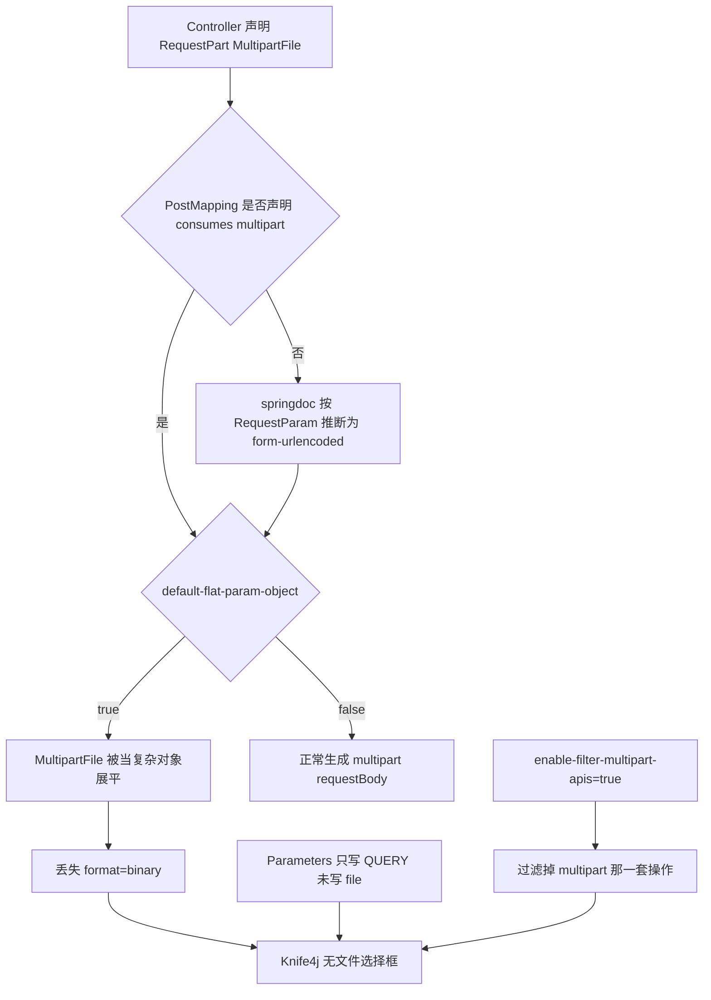

<!-- toc -->

# 概述

Spring Boot 2.x 项目用 Knife4j 4.x（底层 springdoc-openapi 1.7.x）生成 OpenAPI 3 文档时，带 `MultipartFile` 的上传接口在 Debug 页经常看不到文件选择框：业务接口本身能正常收文件，文档里却只剩 query 参数。根因通常不是 Controller 没声明文件参数，而是 `springdoc.default-flat-param-object=true` 把 `MultipartFile` 当成复杂对象展平，再叠加接口未声明 `consumes=multipart/form-data`，OpenAPI 模型里丢失了 `format=binary` 字段。

本文按一次真实排查记录：从现象定位、排除干扰项、对照 OpenAPI 3 文件上传模型，到接口级修复与验证。适用于仍运行 JDK 8、Spring Boot 2、Knife4j OpenAPI3 starter 的服务。

| 项 | 说明 |
|----|------|
| 问题 | Knife4j Debug 看不到 `MultipartFile` 对应的文件上传控件 |
| 运行时 | 接口用 `@RequestPart` 仍可正常接收 multipart 请求 |
| 主因 | `springdoc.default-flat-param-object=true` 与文件参数建模冲突 |
| 诱因 | `@PostMapping` 未声明 `consumes`，`@Parameters` 未声明 `file` |
| 推荐处理 | 接口级补 `consumes` + `schema type=string, format=binary` |
| 验证环境 | Knife4j 4.5.0 + springdoc-openapi 1.7.0 + JDK 8 |

**环境示例：**

| 角色 | 示例地址 |
|------|----------|
| 业务服务 | `http://<app-host>:<port>` |
| Knife4j 文档 | `http://<app-host>:<port>/doc.html` |
| OpenAPI JSON | `http://<app-host>:<port>/v3/api-docs` |
| 网关聚合文档 | `http://<gateway-host>:<port>/doc.html` |

# 环境要求

| 项 | 建议 |
|----|------|
| JDK | 1.8 |
| Spring Boot | 2.6.x / 2.7.x |
| Knife4j | `knife4j-openapi3-spring-boot-starter` 4.3.0～4.5.0 |
| springdoc | 1.7.x（由 Knife4j 4.5.0 引入 1.7.0） |
| 文档协议 | OpenAPI 3（不是 Springfox / Swagger 2） |

> Knife4j 作者在相关 issue 中明确：文件控件消失是 springdoc 解析问题，不是 UI 渲染问题。4.5.0 仍存在。

# 现象与范围

## 典型症状

打开 Knife4j，进入带文件上传的 POST 接口（例如图生图、分片上传）：

| 观察项 | 实际表现 |
|--------|----------|
| 接口是否出现在文档中 | 出现 |
| `prompt`、`materialId` 等 `@RequestParam` | 出现，多为 Query |
| `file`（`MultipartFile`） | 不出现，或变成普通文本框 |
| 请求类型 | 常被识别为 `application/x-www-form-urlencoded` |
| 真实 HTTP 调用 | 用 Postman / 客户端按 multipart 上传仍然成功 |

## 容易误判的点

`@ApiLog(excludes = {MultipartFile.class})` 只影响日志是否打印文件内容，与文档生成无关。不要把它当成 Knife4j 缺参的原因。

# 根因分析

## OpenAPI 3 对文件参数的要求

OpenAPI 3 里，文件不能写成 `in=query` 的 Parameter。必须落在 requestBody：

```yaml
requestBody:
  content:
    multipart/form-data:
      schema:
        type: object
        properties:
          file:
            type: string
            format: binary
```

Knife4j 只有读到上述模型，才会画出文件选择框。模型缺失或媒体类型变成 `application/x-www-form-urlencoded` 时，Debug 页就不会出现上传控件。

## 三条原因如何叠加



### 主因：`default-flat-param-object=true`

公共配置里常见如下开关：

```yaml
springdoc:
  default-flat-param-object: true
```

| 参数 | 含义 |
|------|------|
| `default-flat-param-object` | 把 `@ParameterObject` 一类复杂对象拆成多个 query 参数 |

`MultipartFile` 是带 `getOriginalFilename()`、`getBytes()` 等方法的接口。springdoc 1.7.x 会错误地对它做展平，不再生成 `type=string, format=binary`。社区复现结论一致：打开该开关后，所有 `@RequestPart MultipartFile` 从文档中消失，请求类型变成 `application/x-www-form-urlencoded`。

### 诱因：未声明 `consumes`

```java
@PostMapping({"/v1/image/create"})
public R create(@RequestPart("file") MultipartFile file,
                @RequestParam("prompt") String prompt) { ... }
```

运行时 Spring MVC 仍能绑定 `@RequestPart`。文档侧则根据旁边的 `@RequestParam` 把 Content-Type 推断成表单编码，而不是 `multipart/form-data`。

### 文档缺口：`@Parameters` 只写 QUERY

```java
@Parameters({
    @Parameter(name = "prompt", required = true, in = ParameterIn.QUERY),
    @Parameter(name = "title", in = ParameterIn.QUERY)
})
```

`@Parameter(in = QUERY)` 只能描述 query / path / header / cookie。即使补上 `name=file, in=QUERY`，Knife4j 也只会画出文本框。`file` 必须用 `schema format=binary` 走进 requestBody。

### 加重项：过滤 multipart 接口副本

```yaml
knife4j:
  setting:
    enable-filter-multipart-apis: true
```

| 参数 | 含义 |
|------|------|
| `enable-filter-multipart-apis` | 接口未指定 consumes 时，过滤 `multipart/form-data` 那一套文档 |

该开关最初面向 Springfox：一个 `@RequestMapping` 会生成多种 Content-Type。OpenAPI 3 下作用较弱，但若 springdoc 同时产出 form-urlencoded 与 multipart 两套操作，Knife4j 可能只留下没有文件框的那套。它不能单独解释缺参，但会放大问题。

# 核心步骤

## 对照接口与配置

先确认三件事，避免一上来改全局配置：

| 检查项 | 期望 | 出问题时的常见值 |
|--------|------|------------------|
| `@PostMapping.consumes` | `MediaType.MULTIPART_FORM_DATA_VALUE` | 未声明 |
| `file` 的 OpenAPI schema | `type=string, format=binary` | 无，或被展平成对象字段 |
| `springdoc.default-flat-param-object` | 可保持 `true`（若其它接口依赖展平） | `true` 且未给 file 补 schema |
| `@ApiLog excludes MultipartFile` | 可忽略 | 误当成根因 |

查看已发布的文档模型：

```bash
curl -s "http://<app-host>:<port>/v3/api-docs" | grep -n "multipart/form-data"
```

目标 path 的 POST 操作应出现 `multipart/form-data`，且 `file` 的 schema 含 `"format": "binary"`。若只有 `application/x-www-form-urlencoded`，即可判定文档模型错误。

## 接口级修复（推荐）

不改全局 `default-flat-param-object`，避免把其它 `@ParameterObject` 的 query 展平行为打回去。只在上传接口补两处注解。

```java
@PostMapping(value = "/v1/image/create", consumes = MediaType.MULTIPART_FORM_DATA_VALUE)
@Parameters({
        @Parameter(name = "file", description = "文件", required = true,
                schema = @Schema(type = "string", format = "binary")),
        @Parameter(name = "prompt", required = true, description = "提示词", in = ParameterIn.QUERY),
        @Parameter(name = "title", description = "标题", in = ParameterIn.QUERY)
})
@Operation(summary = "图生图")
public R createByImage(
        @RequestPart("file") MultipartFile file,
        @RequestParam("prompt") String prompt,
        @RequestParam(value = "title", required = false) String title) {
    // 业务逻辑不变
}
```

| 注解 | 作用 |
|------|------|
| `consumes = MULTIPART_FORM_DATA_VALUE` | 强制按 multipart 建模，运行时也只接受该 Content-Type |
| `@Schema(type = "string", format = "binary")` | 阻止把 `MultipartFile` 当对象展平 |
| `@RequestPart("file")` | 与文档字段名、表单 part 名一致 |

需要的 import：

```java
import io.swagger.v3.oas.annotations.Parameter;
import io.swagger.v3.oas.annotations.Parameters;
import io.swagger.v3.oas.annotations.enums.ParameterIn;
import io.swagger.v3.oas.annotations.media.Schema;
import org.springframework.http.MediaType;
import org.springframework.web.bind.annotation.RequestPart;
import org.springframework.web.multipart.MultipartFile;
```

同一服务内所有 `@RequestPart MultipartFile` 的接口按同一写法对齐，避免文档表现不一致。

## 全局开关（不作为首选）

| 方案 | 效果 | 风险 |
|------|------|------|
| `springdoc.default-flat-param-object: false` | 多数上传接口文件控件会回来 | 依赖对象展平的 query 接口展示会变 |
| `knife4j.setting.enable-filter-multipart-apis: false` | 不再丢掉 multipart 文档副本 | 单独改此项通常不够 |

仅当上传接口很多、且确认没有依赖对象展平的文档时，再考虑关 `default-flat-param-object`。

# 配置与验证

## 修复后应看到的文档模型

重启对应微服务后，再次拉取 OpenAPI：

```bash
curl -s "http://<app-host>:<port>/v3/api-docs" \
  | python -c "import sys,json; print(json.load(sys.stdin).get('paths',{}).keys())"
```

在目标 path 的 `post.requestBody.content` 中确认：

| 检查点 | 通过标准 |
|--------|----------|
| 媒体类型 | 存在 `multipart/form-data` |
| `file` | `type=string` 且 `format=binary` |
| Knife4j Debug | 出现文件选择框，可本地选文件后调试 |
| 业务回归 | 原客户端 multipart 调用仍成功 |

若文档走网关聚合，改的是后端服务，需刷新网关侧分组或等聚合缓存失效后再看 `http://<gateway-host>:<port>/doc.html`。

## 运行时副作用

补上 `consumes = multipart/form-data` 后，Spring 只接受该 Content-Type。原先若有人用 `application/x-www-form-urlencoded` 调同一 URL，会收到 415。这与真实文件上传语义一致，一般可接受。

# 常见问题

| 问题 | 原因 | 处理 |
|------|------|------|
| 改了 `@Parameters` 仍无文件框 | 只加了 `in=QUERY` 的 `file` | 必须 `schema format=binary`，并声明 `consumes` |
| 全局关掉 `default-flat-param-object` 后其它 query 对象挤成一团 | 其它接口依赖对象展平 | 保持全局 `true`，只在上传接口补 schema |
| 文档有文件框，调试发的是 urlencoded | 模型媒体类型仍不是 multipart | 检查 `consumes` 是否生效、服务是否已重启 |
| GET 上传接口控件仍异常 | GET + multipart 本就不标准 | 文档可同样补 schema；长期建议改为 POST |
| 网关文档仍是旧模型 | 聚合缓存或未刷新分组 | 重启提供文档的服务后再刷新 `doc.html` |
| 日志里没有文件内容 | `@ApiLog excludes MultipartFile` | 预期行为，与文档无关 |

完成上述接口注解后，重启服务，在 Knife4j Debug 页确认文件选择框可用，并用原客户端再打一笔 multipart 请求，确认 415 与业务结果都符合预期。
