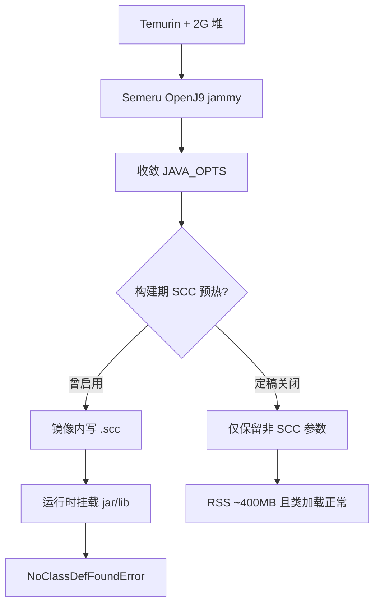

---

title: OpenJ9微服务镜像容器优化
categories:
	- Docker
tags:
	- OpenJ9
	- Docker

date: 2026-08-07 17:18:09

---

# 背景

项目微服务模块基于Docker部署，最近发现服务占用的内存使用量过高，对宿主机服务器的资源利用率造成严重的影响，根据针对容器环境中各种JVM运行性能和资源利用率的综合分析，最终决定将JDK替换为IBM openJ9，并针对OpenJ9的JVM参数进行优化，以降低JVM的内存占用，提高资源利用率。

openJ9介绍

Eclipse OpenJ9是一款高性能、可扩展的Java虚拟机(JVM)实现，凝聚了数百人年的心血。OpenJ9 JVM由IBM贡献给Eclipse项目，是IBM SDK Java技术版的基础，而IBM SDK Java技术版又是众多IBM企业软件产品的核心组件。Eclipse基金会持续开发 OpenJ9，确保了更广泛的合作、持续的创新，以及影响下一代Java应用程序OpenJ9开发的机会。

| 项     | 说明                                                                  |
|:------|:--------------------------------------------------------------------|
| 问题    | 固定 2G 堆占用高；HotSpot 参数与 OpenJ9 不兼容；SCC 预热与挂载 lib 冲突                  |
| 优化    | Semeru OpenJ9 + gencon/`-Xmx1024m`；去掉 `-Xshareclasses` 与构建期 SCC 预热  |
| 效果    | 稳态 RSS 约 350～400MB；挂载 lib 后类加载正常；验证码链路可保留                           |
| 样板服务  | `clearstream-admin-biz`                                             |


**环境示例：**


| 角色    | 示例地址                               |
|:------|:-----------------------------------|
| 编排节点  | `10.20.35.88`                      |
| 注册中心  | `nacos.demo-lab.net:8848`          |
| 业务端口  | `9020`                             |
| 镜像仓库  | `harbor.demo-lab.net/clearstream`  |


# 环境要求


| 项          | 要求                                                                 |
|:-----------|:-------------------------------------------------------------------|
| JDK 目标字节码  | Java 8                                                             |
| 基础镜像       | Ubuntu jammy + glibc（禁止 musl/Alpine，AWT/GifCaptcha 依赖）             |
| 系统包        | `procps`、`fontconfig`、`fonts-dejavu-core`、`libfreetype6`、`tzdata`  |
| 打包形态       | 瘦 jar + 外置 `lib/`（构建与运行 classpath 可能不一致）                           |
| 编排         | Docker Swarm / Compose 均可                                          |


> 依赖 AWT 时必须 `-Djava.awt.headless=true`，并安装字体相关包后执行 `fc-cache -fv`。

# 优化思路




| 手段                                 | 作用             | 定稿取舍                         |
|:-----------------------------------|:---------------|:-----------------------------|
| 换 OpenJ9                           | 降低常驻、改 gencon  | 保留                           |
| `-Xms512m -Xmx1024m`               | 替代固定 2G 堆      | 保留，压测再调                      |
| `-Xtune:virtualized` / IdleTuning  | 容器场景与空闲回收      | 保留                           |
| `-Xshareclasses` + 构建预热            | 写 SCC / AOT    | **删除**（挂载 lib 后类路径易失配）       |
| `-Xquickstart`                     | 启动期编译策略        | 可保留；对 Spring Started 秒数帮助有限  |


# 核心步骤

## 切换基础镜像与系统依赖

```dockerfile
FROM ibm-semeru-runtimes:open-8-jre-jammy

RUN set -eux; \
    apt-get update && apt-get install -y --no-install-recommends \
        procps fontconfig fonts-dejavu-core libfreetype6 tzdata; \
    apt-get clean; rm -rf /var/lib/apt/lists/* /var/cache/apt/*; \
    fc-cache -fv
```


| 参数/包                | 含义                                |
|:--------------------|:----------------------------------|
| `open-8-jre-jammy`  | OpenJ9 JRE8 + Ubuntu 22.04 glibc  |
| `fontconfig` 等      | AWT/验证码字体链路                       |
| `tzdata`            | 系统时区数据；业务时区仍可用编排 `TZ` 注入          |


**备选方式：** 勿长期使用已弃用的 `adoptopenjdk:8-jre-openj9`；仅内网缓存临时过渡时可改 `FROM`，apt 段可不变。

## 收敛 HotSpot → OpenJ9 参数

删除 HotSpot 专用项：`UseG1GC`、`MaxGCPauseMillis`、`NewRatio`、`SurvivorRatio`、`MetaspaceSize`、`MaxMetaspaceSize`。

```bash
JAVA_OPTS="\
-Xms512m -Xmx1024m \
-Xgcpolicy:gencon \
-Xtune:virtualized \
-Djava.awt.headless=true \
-Djava.security.egd=file:/dev/./urandom \
-Dfile.encoding=UTF-8"

OPENJ9_JAVA_OPTIONS="\
-Xquickstart \
-XX:+IgnoreUnrecognizedVMOptions \
-XX:+IdleTuningGcOnIdle"
```


| 参数                                         | 含义                |
|:-------------------------------------------|:------------------|
| `-Xgcpolicy:gencon`                        | OpenJ9 分代并发 GC    |
| `-Xtune:virtualized`                       | 容器/虚拟化调优          |
| `-Djava.security.egd=file:/dev/./urandom`  | 避免熵源阻塞启动          |
| `-XX:+IdleTuningGcOnIdle`                  | 空闲时调优/回收，利于压 RSS  |
| `-XX:+IgnoreUnrecognizedVMOptions`         | 忽略无法识别的 XX        |


> OpenJ9 会自动读取环境变量 `OPENJ9_JAVA_OPTIONS`。CMD 若再显式拼接同名变量，注意避免选项重复注入。

## 禁止构建期 SCC 预热

外置 `lib/` / 挂载 jar 时，构建期写入的 Shared Class Cache 与运行期 classpath 不一致，会出现类找不到（例如业务工具类 → `NoClassDefFoundError`）。

定稿 Dockerfile **不要**包含：

- `mkdir /opt/java/.scc`
- `-Xshareclasses` / `-XX:+PortableSharedCache` / `-Xscmx`*
- 构建阶段 `timeout`/`sleep` 拉起 jar 写 SCC 的 `RUN`

## 定稿启动形态

```dockerfile
FROM ibm-semeru-runtimes:open-8-jre-jammy

RUN set -eux; \
    apt-get update && apt-get install -y --no-install-recommends \
        procps fontconfig fonts-dejavu-core libfreetype6 tzdata; \
    apt-get clean; rm -rf /var/lib/apt/lists/* /var/cache/apt/*; \
    fc-cache -fv \
    
WORKDIR /home/clearstream
COPY lib lib/
COPY jar/clearstream-admin-biz.jar .

ENV JAVA_OPTS="\
-Xms512m -Xmx1024m \
-Xgcpolicy:gencon \
-Xtune:virtualized \
-Djava.awt.headless=true \
-Djava.security.egd=file:/dev/./urandom \
-Dfile.encoding=UTF-8"

ENV OPENJ9_JAVA_OPTIONS="\
-Xquickstart \
-XX:+IgnoreUnrecognizedVMOptions \
-XX:+IdleTuningGcOnIdle"

ENTRYPOINT ["/bin/sh", "-c"]
CMD ["/wait && exec java $JAVA_OPTS $OPENJ9_JAVA_OPTIONS -jar clearstream-admin-biz.jar"]
```

参数放置约定：


| 内容                           | 放置位置                           |
|:-----------------------------|:-------------------------------|
| 堆 / GC / headless / urandom  | Dockerfile `JAVA_OPTS`（编排可覆盖）  |
| OpenJ9 非 SCC 项               | `OPENJ9_JAVA_OPTIONS`          |
| 业务时区等                        | 编排侧 `TZ` 或追加 JVM 属性，避免镜像锁死环境   |


## 编排资源建议

```yaml
deploy:
  resources:
    limits:
      cpus: "2.0"
      memory: 1G
    reservations:
      cpus: "0.5"
      memory: 512M
```


| 项                      | 建议              | 说明                          |
|:-----------------------|:----------------|:----------------------------|
| `limits.memory`        | 约 1G（不低于 768M）  | 稳态 ~400MB；过小易在尖峰/堆外 OOMKill |
| `limits.cpus`          | ≥ 2.0 或可不设硬限    | 首包阶段可近 200% CPU             |
| `reservations.memory`  | 512M            | 与实测 RSS 匹配                  |


# 验证


| 检查项             | 预期                                             |
|:----------------|:-----------------------------------------------|
| `java -version` | 输出含 OpenJ9 / Semeru                            |
| 启动日志            | 出现 `Started ...Application`，无 OOM              |
| 注册              | 注册中心可见实例（示例 `10.20.35.88:9020`）                |
| 内存              | 稳态物理内存约 350～400MB                              |
| CPU             | 空闲很低；启动/首包可短时打满约 2 核                           |
| 类加载             | 挂载更新后的 `lib/` 后关键类可加载，无 `NoClassDefFoundError` |
| 验证码             | `/getCaptcha`（或等价接口）可出图                        |


OpenJ9稳态内存

实测样板：Spring Started 约 **46～54s**（多轮波动）。继续压启动应优先懒加载与缩减启动期 Bean，而不是恢复 SCC。

# 常见问题


| 问题                                   | 原因                               | 处理                                                        |
|:-------------------------------------|:---------------------------------|:----------------------------------------------------------|
| `NoClassDefFoundError`（挂载 jar/lib 后） | 构建期 SCC 与运行期 classpath 不一致       | 去掉 `-Xshareclasses` 与预热 `RUN`，重建镜像                        |
| 验证码空白/字体异常                           | 缺字体包或未 headless                  | 安装 fontconfig 等 + `-Djava.awt.headless=true` + `fc-cache` |
| 启动卡很久才起来                             | 熵源阻塞                             | 加 `-Djava.security.egd=file:/dev/./urandom`               |
| Started ~50s，OpenJ9「没加速」             | 耗时在 Nacos/扫包/MyBatis/建 Bean      | 用 DEBUG 拆阶段；应用侧懒加载；勿指望 SCC                                |
| 容器被 OOMKill                          | limit 过紧或堆外未留余量                  | `memory` limit 提到约 1G；先稳住 `-Xmx1024m` 再压测降堆               |
| `ps` 看不到部分 OpenJ9 参数                 | `OPENJ9_JAVA_OPTIONS` 由 JVM 静默合并 | 用 `printenv OPENJ9_JAVA_OPTIONS` 核对                       |

# 验证


