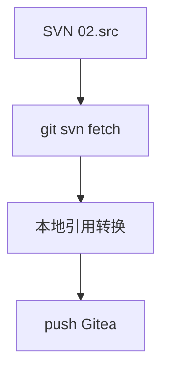

<!-- toc -->

# <span id="inline-blue">概述</span>

用 `git svn` 将标准「序号 + 项目名」SVN 源码仓（含 trunk / branches / tags）迁到 Gitea，并保留完整提交历史。已在 Git Bash 下验证。文中项目名、主机、账号、邮箱等敏感信息已用随机数据脱敏，请按实际环境替换。

| 项 | 说明 |
|----|------|
| 工具 | `git svn` |
| 目标 | Gitea，默认分支 `main` |
| 范围 | `02.src` 的 trunk、branches、tags |
| 作者映射 | 仓库外 `authors.txt`，勿提交 |

**环境示例：**

| 角色 | 示例地址 |
|------|----------|
| SVN 根 | `http://svn.corp-demo.local/REPO` |
| 项目 | `42.ClearStream` |
| 本地目录 | `/data/migrate/ClearStream` |
| 作者文件 | `/data/migrate/clearstream-authors.txt` |
| Gitea | `http://git.demo-lab.net:3000/ACME/ClearStream.git` |
| 提交人 | `陈思远` / `chen.siyuan@demo-mail.com` |



# <span id="inline-blue">迁移范围</span>

```
42.ClearStream/
├── 01.doc/          # 不迁入源码仓
└── 02.src/
    ├── trunk/       # → main
    ├── branches/    # → Git 分支
    └── tags/        # → Git 标签
```

| 范围 | 是否迁入 |
|------|----------|
| `trunk` / `branches` / `tags` | 是（作 refs，不是目录进 main） |
| `01.doc` | 否 |

`git svn init` 必须用 `-T/-b/-t` 指定布局；`git config svn.trunk` 无效，会导致 `main` 出现 `01.doc`、`02.src/...` 整棵目录。

# <span id="inline-blue">环境要求</span>

| 项 | 建议 |
|----|------|
| 环境 | Git Bash / Linux，磁盘预留数 GB |
| 校验 | `git svn --version`、`svn --version` |

# <span id="inline-blue">生成 authors.txt</span>

```bash
svn log "http://svn.corp-demo.local/REPO/42.ClearStream" --xml > /data/migrate/svn-log.xml

grep '<author>' /data/migrate/svn-log.xml \
  | sed 's/.*<author>\(.*\)<\/author>.*/\1/' \
  | sort -u > /data/migrate/svn-authors-raw.txt

while read author; do
  name=$(echo "$author" | sed 's/.*\\//')
  echo "$author = $name <${name}@demo-mail.com>"
done < /data/migrate/svn-authors-raw.txt > /data/migrate/clearstream-authors.txt
```

手工校对右侧为真实姓名与邮箱。等号左边须与 SVN 作者完全一致。

**安全要求：** `authors.txt` 不进 Git；勿写入真实密码。

# <span id="inline-blue">核心步骤</span>

## 初始化并拉取

```bash
mkdir -p /data/migrate/ClearStream && cd /data/migrate/ClearStream

git svn init http://svn.corp-demo.local/REPO \
  -T 42.ClearStream/02.src/trunk \
  -b 42.ClearStream/02.src/branches \
  -t 42.ClearStream/02.src/tags \
  --no-metadata

git config svn.authorsfile /data/migrate/clearstream-authors.txt
git svn fetch --log-window-size 1000
```

| 参数 | 含义 |
|------|------|
| `-T/-b/-t` | trunk / branches / tags 布局 |
| `--no-metadata` | 不追加 `git-svn-id` |
| `--log-window-size` | 大仓库加速 log 查询 |

fetch 后分支在 `refs/remotes/origin/*`，标签在 `refs/remotes/origin/tags/*`，**尚未**变成可 push 的本地 branch/tag。`git branch -r` 里的 `origin/*` 不会自动进 Gitea。

## 检出 main 与本地整理

```bash
git checkout -b master refs/remotes/origin/trunk
git branch -M main

git config --local user.name "陈思远"
git config --local user.email "chen.siyuan@demo-mail.com"

git add .gitignore
git commit -m "chore: 添加忽略规则"
```

## 转换 branches / tags

```bash
# 分支：跳过 trunk（已是 main）
git for-each-ref --format='%(refname:short)' refs/remotes/origin \
  | grep -vE '^origin/(tags/|trunk$)' \
  | while read ref; do git branch "${ref#origin/}" "$ref"; done

# 标签
git for-each-ref --format='%(refname:short)' refs/remotes/origin/tags | while read ref; do
  t=${ref#origin/tags/}
  git tag "$t" "refs/remotes/origin/tags/$t"
done
```

名称含 `@rev` 的是 git-svn peg 历史快照（如 `feature_x@85944`），完整迁移应保留并推送。

## 推送 Gitea

Gitea 建**空仓库**（勿初始化 README）：

```bash
git remote add origin http://git.demo-lab.net:3000/ACME/ClearStream.git
git push -u origin main
git push origin --all
git push origin --tags
```

带 `@` 的 ref 必要时加引号：`git push origin "feature_x@85944"`。

# <span id="inline-blue">验证</span>

```bash
git ls-remote --heads origin    # 含 main 与全部业务分支
git ls-remote --tags origin     # 数量与本地 git tag -l 一致
git log --format="%an <%ae>" | sort -u   # 无 (no author)
```

工作区根目录应为源码顶层，不应再出现 `02.src/trunk`。


# <span id="inline-blue">常见问题</span>

| 问题 | 原因 | 处理 |
|------|------|------|
| main 含 `01.doc` / `02.src` | init 未用 `-T/-b/-t` | 按布局重迁 |
| 远程只有 main | 未转本地 branch/tag | 执行转换后再 push |
| `branch -r` 仍有 `origin/tags` | git-svn 缓存 | 不影响 push；可 `fetch --prune` 清理 |
| `(no author)` | authors 不全 | 补全后重新 fetch |
| `@` ref 推送失败 | shell 未引号 | `git push origin "name@rev"` |
| Gitea 非空冲突 | 勾了 README | 清空远程或处理无关历史后重推 |

# <span id="inline-blue">完整命令清单</span>

```bash
# ── 1. authors.txt ──
svn log "http://svn.corp-demo.local/REPO/42.ClearStream" --xml > /data/migrate/svn-log.xml
grep '<author>' /data/migrate/svn-log.xml \
  | sed 's/.*<author>\(.*\)<\/author>.*/\1/' \
  | sort -u > /data/migrate/svn-authors-raw.txt
while read author; do
  name=$(echo "$author" | sed 's/.*\\//')
  echo "$author = $name <${name}@demo-mail.com>"
done < /data/migrate/svn-authors-raw.txt > /data/migrate/clearstream-authors.txt

# ── 2. fetch ──
mkdir -p /data/migrate/ClearStream && cd /data/migrate/ClearStream
git svn init http://svn.corp-demo.local/REPO \
  -T 42.ClearStream/02.src/trunk \
  -b 42.ClearStream/02.src/branches \
  -t 42.ClearStream/02.src/tags \
  --no-metadata
git config svn.authorsfile /data/migrate/clearstream-authors.txt
git svn fetch --log-window-size 1000

# ── 3. main + 提交人 ──
git checkout -b master refs/remotes/origin/trunk
git branch -M main
git config --local user.name "陈思远"
git config --local user.email "chen.siyuan@demo-mail.com"

# ── 4. 本地分支 / 标签 ──
git for-each-ref --format='%(refname:short)' refs/remotes/origin \
  | grep -vE '^origin/(tags/|trunk$)' \
  | while read ref; do git branch "${ref#origin/}" "$ref"; done
git for-each-ref --format='%(refname:short)' refs/remotes/origin/tags | while read ref; do
  t=${ref#origin/tags/}; git tag "$t" "refs/remotes/origin/tags/$t"
done

# ── 5. 推送并校验 ──
git remote add origin http://git.demo-lab.net:3000/ACME/ClearStream.git
git push -u origin main && git push origin --all && git push origin --tags
git ls-remote --heads origin
git ls-remote --tags origin | wc -l
```

完成后执行：`git clone http://git.demo-lab.net:3000/ACME/ClearStream.git`。
