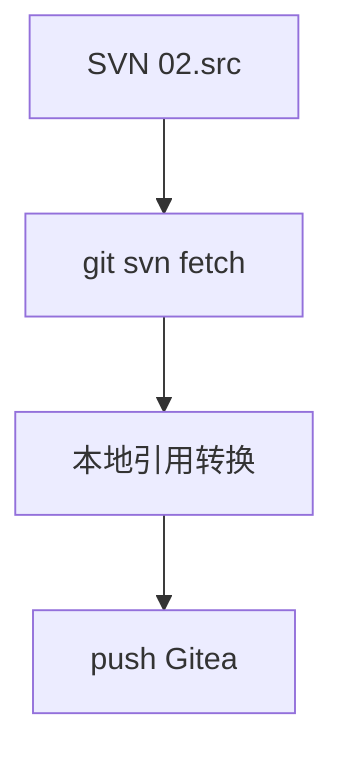

<!-- toc -->

# 概述

用 `git svn` 将标准「序号 + 项目名」SVN 源码仓（含 trunk / branches / tags）迁到 Gitea，并保留完整提交历史。已在 Git Bash 下验证。文中项目名、主机、账号、邮箱等敏感信息已用随机数据脱敏，请按实际环境替换。

| 项    | 说明                             |
|:-----|:-------------------------------|
| 工具   | `git svn`                      |
| 目标   | Gitea，默认分支 `main`              |
| 范围   | `02.src` 的 trunk、branches、tags |
| 作者映射 | 仓库外 `authors.txt`，勿提交          |

**环境示例：**

| 角色    | 示例地址                                                |
|:------|:----------------------------------------------------|
| SVN 根 | `http://svn.corp-demo.local/REPO`                   |
| 项目    | `42.ClearStream`                                    |
| 本地目录  | `/data/migrate/ClearStream`                         |
| 作者文件  | `/data/migrate/clearstream-authors.txt`             |
| Gitea | `http://git.demo-lab.net:3000/ACME/ClearStream.git` |
| 提交人   | `陈思远` / `chen.siyuan@demo-mail.com`                 |


```mermaid
flowchart TB
  A[SVN 02.src] --> B[git svn fetch]
  B --> C[本地引用转换]
  C --> D[push Gitea]
```

# 迁移范围

```
42.ClearStream/
├── 01.doc/          # 不迁入源码仓
└── 02.src/
    ├── trunk/       # → main
    ├── branches/    # → Git 分支
    └── tags/        # → Git 标签
```

| 范围                            | 是否迁入                 |
|:------------------------------|:---------------------|
| `trunk` / `branches` / `tags` | 是（作 refs，不是目录进 main） |
| `01.doc`                      | 否                    |

`git svn init` 必须用 `-T/-b/-t` 指定布局；`git config svn.trunk` 无效，会导致 `main` 出现 `01.doc`、`02.src/...` 整棵目录。

# 环境要求

| 项   | 建议                                  |
|:----|:------------------------------------|
| 环境  | Git Bash / Linux，磁盘预留数 GB           |
| 校验  | `git svn --version`、`svn --version` |

# 生成 authors.txt

```bash
svn log "http://svn.corp-demo.local/REPO/42.ClearStream" --xml > /data/migrate/svn-log.xml

grep '<author>' /data/migrate/svn-log.xml \
  | sed 's/.*<author>\(.*\)<\/author>.*/\1/' \
  | sort -u > /data/migrate/svn-authors-raw.txt

while read author; do
  name=$(echo "$author" | sed 's/.*\\//')
  echo "$author = $name <${name}@demo-mail.com>"
done < /data/migrate/svn-authors-raw.txt > /data/migrate/clearstream-authors.txt
```

手工校对右侧为真实姓名与邮箱。等号左边须与 SVN 作者完全一致。

**安全要求：** `authors.txt` 不进 Git；勿写入真实密码。

# 核心步骤

## 初始化并拉取

```bash
mkdir -p /data/migrate/ClearStream && cd /data/migrate/ClearStream

git svn init http://svn.corp-demo.local/REPO \
  -T 42.ClearStream/02.src/trunk \
  -b 42.ClearStream/02.src/branches \
  -t 42.ClearStream/02.src/tags \
  --no-metadata

git config svn.authorsfile /data/migrate/clearstream-authors.txt
git svn fetch --log-window-size 1000
```

| 参数                  | 含义                         |
|:--------------------|:---------------------------|
| `-T/-b/-t`          | trunk / branches / tags 布局 |
| `--no-metadata`     | 不追加 `git-svn-id`           |
| `--log-window-size` | 大仓库加速 log 查询               |

fetch 后分支在 `refs/remotes/origin/*`，标签在 `refs/remotes/origin/tags/*`，**尚未**变成可 push 的本地 branch/tag。`git branch -r` 里的 `origin/*` 不会自动进 Gitea。

## 检出 main 与本地整理

```bash
#检出远程根分支trunk，并重命名为main
git checkout -b master refs/remotes/origin/trunk
git branch -M main
#配置当前git项目代码提交人员信息
git config --local user.name "陈思远"
git config --local user.email "chen.siyuan@demo-mail.com"
#为项目添加.gitignore文件
git add .gitignore
git commit -m "chore: 添加忽略规则"
```

## 转换 branches / tags
在使用git-svn将SVN项目迁移为git仓库后会发现，迁移后的branch和tag全部都被归属为branch,而tag并没有被正确迁移。这是因为git-svn在迁移过程中，会将所有的branches和tags都当作branch来处理，因此需要手动将branches和tags转换为git的branch和tag。
如果branch和tag数量不是很多的情况下，可以直接手动执行转换，命令参考如下：

tag:
```bash
git tag repository-v1.0 origin/tags/repository-v1.0

branch:
```bash
git branch repository-branch origin/branches/repository-branch
```

通过shell脚本方式批量转换
```bash
# 查看当前git项目仓库的分支branch
git branch -r
# 将迁移后的仓库代码tags转换为git的本地tag
for tag in $(git branch -r | grep 'tags/' | sed 's|origin/tags/||'); do
  git tag "$tag" "origin/tags/$tag"
done


# 将迁移后的仓库代码branches转换为git的本地branch
git branch -r \
| grep -v 'tags/' \
| grep -v 'HEAD' \
| while read branch; do
    local_branch=${branch#origin/}
    git branch "$local_branch" "$branch"
done
```

## 推送 Gitea

Gitea 建**空仓库**（勿初始化 README）：

```bash
#git不跟踪记录空文件夹，需要在空文件夹中创建占位符文件.gitkeep
#使用git命令行工具git bash到项目根目录下执行
find . -type d -not -path './.git/*' -not -path './.git' -empty   ! -exec test -f '{}/.gitkeep' \;   -exec touch '{}/.gitkeep' \;
#采用ssh协议，避免http传输不稳定，导致git clone失败
git remote add origin git@git.demo-lab.net:ACME/ClearStream.git
#推送本地branch和tag分支到远程仓库
git push -u origin main
git push origin --all
git push origin --tags
```

# 验证

```bash
#查看远程分支
git ls-remote --heads origin  
#查看远程标签  
git ls-remote --tags origin  
#查看项目仓库日志  
git log --format="%an <%ae>" | sort -u   
```

工作区根目录应为源码顶层，不应再出现 `02.src/trunk`。

验收以 `git ls-remote --heads/--tags` 与本地分支、标签数量一致为准。

# 常见问题

| 问题                           | 原因                 | 操作                            |
|:-----------------------------|:-------------------|:------------------------------|
| main 含 `01.doc` / `02.src`   | init 未用 `-T/-b/-t` | 按布局重迁                         |
| 远程只有 main                    | 未转本地 branch/tag    | 执行转换后再 push                   |
| `branch -r` 仍有 `origin/tags` | git-svn 缓存         | 不影响 push；可 `fetch --prune` 清理 |
| `(no author)`                | authors 不全         | 补全后重新 fetch                   |
| `@` ref 推送失败                 | shell 未引号          | `git push origin "name@rev"`  |
| Gitea 非空冲突                   | 勾了 README          | 清空远程或处理无关历史后重推                |


