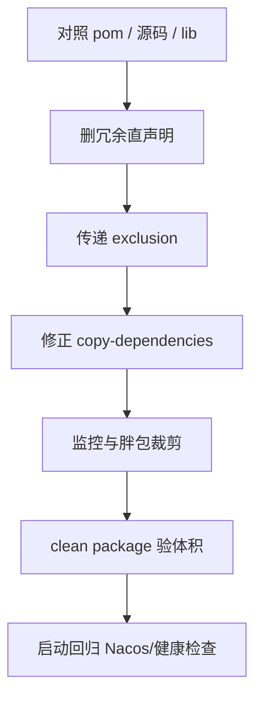
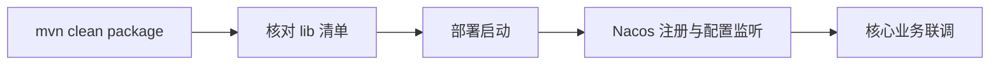

---

title: SpringBoot微服务Jar包瘦身实现
categories:
	- SpringBoot
tags:
	- SpringBoot
	- Maven

date: 2026-08-10 09:08:57
---
 


# 概述

管理端微服务外置 `lib` 一度膨胀到 **407** 个 jar、约 **240MB**，镜像同步与发布成本偏高，其中混入未使用直声明、测试包、Tomcat 残留与重复胖包。以「源码实际引用 + bootstrap 配置 + `target/lib` 体积」三方对照裁剪 Maven 依赖，修正 `copy-dependencies` 为 `runtime` 范围并补 exclusion，同时去掉无效 Prometheus/p6spy、将 `hutool-all` 改为 `hutool-core`。落地后 jar 数约 **348～351**、体积约 **204～205MB**，相对基线减少约 **56** 个包、**35MB（约 14%）**，核心业务与 `/actuator/health` 可用。


| 项    | 说明                                                                                |
| ---- | --------------------------------------------------------------------------------- |
| 问题   | 外置 lib 过大；冗余直声明/测试包/Tomcat/重复 hutool 进入运行时 classpath                              |
| 优化   | 删未用依赖与 ES；Undertow 排除 Tomcat；打包 runtime + 黑名单；下线 Prometheus/p6spy；hutool-all→core |
| 效果   | jar **407→~350**，体积 **240MB→~205MB**；支付验单/AI 结果/验证码等能力保留                          |
| 样板模块 | `clearstream-admin-biz`                                                           |


**环境示例：**


| 角色   | 示例地址                                                          |
| ---- | ------------------------------------------------------------- |
| 构建机  | `10.20.35.88`                                                 |
| 模块路径 | `D:/work/ClearStream/clearstream-admin/clearstream-admin-biz` |
| 产物目录 | `target/lib`                                                  |
| JDK  | 8                                                             |


# 环境要求


| 项      | 要求                                                               |
| ------ | ---------------------------------------------------------------- |
| JDK    | 8                                                                |
| 构建     | Maven；并行示例 `mvn clean package -DskipTests -T 1C`                 |
| Web 容器 | Undertow（排除 `spring-boot-starter-tomcat`，保留 `tomcat-embed-el`）   |
| 打包形态   | 瘦业务 jar + 外置 `lib/`（`maven-dependency-plugin` copy-dependencies） |
| 分析原则   | 以业务引用为准；`dependency:analyze` 仅辅助（Spring 场景误报多）                   |


> `copy-dependencies` 不会清理 lib 中历史 jar，发布前必须 `clean package`。

# 优化思路



依赖处置分层：


| 层级    | 动作                                                            |
| ----- | ------------------------------------------------------------- |
| 直声明层  | 删除本模块未用或已由 common 传递的依赖                                       |
| 传递排除层 | 在入口依赖上 exclusion Tomcat、p6spy 等                               |
| 打包过滤层 | `includeScope=runtime` + 排除 lombok/byte-buddy/junit 等         |
| 公共微调  | `common-emqx`：`hutool-all` → `hutool-core`（仅用 StrUtil/Base64） |


体积大头仍在且本轮不可砍（业务必需）：


| Jar             | 约     | 来源                       |
| --------------- | ----- | ------------------------ |
| alipay-sdk-java | 29 MB | service-pay → common-pay |
| volc-sdk-java   | 22 MB | service → common-ai      |
| stripe-java     | 16 MB | common-pay               |


# 核心步骤

## 删除冗余直声明与无效模块


| 依赖                                                              | 处置                                   |
| --------------------------------------------------------------- | ------------------------------------ |
| xstream / freemarker / asm / commons-pool2 等                    | 删除（源码无引用）                            |
| jakarta.json* / jackson-datatype-jsr310 / servlet-api / mybatis | 删除（已传递或随 ES 移除）                      |
| common-base / common-log 直声明                                    | 删除（经 service/security 传递）            |
| common-elasticsearch                                            | 删除；bootstrap 去掉 `elasticsearch.yml`  |
| 多余 test 直声明                                                     | 合并为 `starter-test` + `security-test` |


## 补全 Tomcat exclusion，统一 Undertow

在 `common-service` / `service-pay` / `security` / `doc` 等入口依赖上 exclusion `spring-boot-starter-tomcat`。

> `tomcat-embed-el` 因 Undertow 表达式语言需要而保留；目标是去掉 `tomcat-embed-core` 等残留。

## 修正外置 lib 打包规则

```xml
<plugin>
  <groupId>org.apache.maven.plugins</groupId>
  <artifactId>maven-dependency-plugin</artifactId>
  <configuration>
    <includeScope>runtime</includeScope>
    <excludeArtifactIds>
      lombok,
      byte-buddy,byte-buddy-agent,
      junit
    </excludeArtifactIds>
  </configuration>
</plugin>
```


| 参数                       | 含义                                                                 |
| ------------------------ | ------------------------------------------------------------------ |
| `includeScope=runtime`   | 测试依赖不进部署 lib                                                       |
| 排除 lombok / byte-buddy   | 避免编译期或 mockito 误提升包进入运行时                                           |
| 排除 junit                 | 避免 SDK 错误标为 compile 的测试包混入                                         |
| **不要**排除 `simpleclient*` | `nacos-client` 的 `MetricsMonitor` 硬依赖 `io.prometheus.client.Gauge` |


## 监控策略：保留 Actuator，去掉 Prometheus/p6spy


| 项                                                          | 处理                                                             |
| ---------------------------------------------------------- | -------------------------------------------------------------- |
| `micrometer-registry-prometheus` / `micrometer-jvm-extras` | 从模块 pom 删除                                                     |
| 启动类中仅服务 Prometheus 的 `MeterRegistryCustomizer`             | 删除                                                             |
| `p6spy-spring-boot-starter`                                | 在 service / service-pay 上 exclusion（不改公共 mybatis 以免影响其他服务）     |
| `spring-boot-starter-actuator`                             | **保留**（`/actuator/health`、security `/actuator/`** 白名单、与兄弟服务一致） |


## hutool 去重

`common-emqx` 实际只用 `StrUtil`/`Base64`：将 `hutool-all`（约 2.4MB）改为 `hutool-core`，避免与其它模块化 `hutool-*` 功能重复。

## 必须保留的业务依赖（勿误删）


| 依赖                                       | 证据/用途                       |
| ---------------------------------------- | --------------------------- |
| common-service-pay                       | 异常订单补录验单（携带支付 SDK）          |
| common-ai（经 service）                     | AI 结果管理；全包扫描下不可简单 exclusion |
| easy-captcha / univocity / httpclient    | 验证码、CSV、短信工具                |
| actuator / undertow / nacos / security 等 | 启动与运维基座                     |


# 验证




| 检查项  | 预期                                                                                                                         |
| ---- | -------------------------------------------------------------------------------------------------------------------------- |
| 构建   | `mvn clean package -DskipTests -T 1C` 成功                                                                                   |
| 体积   | jar 数约 350；`target/lib` 约 205MB                                                                                            |
| 不应存在 | `hutool-all`、`elasticsearch-java`、`p6spy*`、`micrometer-registry-prometheus`、`tomcat-embed-core`、junit/mockito/assertj 等测试包 |
| 应存在  | `spring-boot-starter-actuator`、`undertow-*`、支付/AI SDK、`simpleclient-*.jar`                                                 |
| 启动   | Nacos 注册成功；配置监听阶段无 `NoClassDefFoundError: io.prometheus.client.Gauge`                                                      |
| 业务   | 登录验证码、异常订单补录、AI 结果查询、设备 CSV 等可用                                                                                            |


瘦身后lib体积


| 能力                     | 瘦身后              |
| ---------------------- | ---------------- |
| `/actuator/health`     | 可用               |
| `/actuator/prometheus` | 不可用（已去 registry） |
| p6spy SQL 输出           | 关闭               |
| ES 配置拉取                | 关闭               |


# 常见问题


| 问题                                                     | 原因                                        | 处理                                                           |
| ------------------------------------------------------ | ----------------------------------------- | ------------------------------------------------------------ |
| 启动报 `NoClassDefFoundError: io.prometheus.client.Gauge` | 误把 `simpleclient*` 从 copy-dependencies 排除 | 保留 `simpleclient-*.jar`；仍可不引入 micrometer Prometheus registry |
| lib 体积「没降下来」                                           | 未 `clean`，旧 jar 残留                        | 重新 `mvn clean package`                                       |
| 去掉 Actuator 后健康检查/白名单异常                                | Actuator 不只服务 Prometheus                  | 还原 `spring-boot-starter-actuator`                            |
| 想再砍 60MB+                                              | alipay/stripe/volc 来自 pay/ai 业务链          | 另立项：common-service 可选依赖 + `@ConditionalOnClass`              |
| `dependency:analyze` 全是 Unused                         | Spring 自动配置误报                             | 以 Controller/Service import 与启动配置为准                          |
| docker 部署 lib 仍是旧的                                     | 流水线未同步 `target/lib`                       | 构建产物拷贝到镜像/挂载目录后再发版                                           |


完成上述裁剪与验收后，即可将同一套「引用对照 + runtime 打包 + 谨慎 exclusion」方法复用到其它外置 lib 微服务模块。