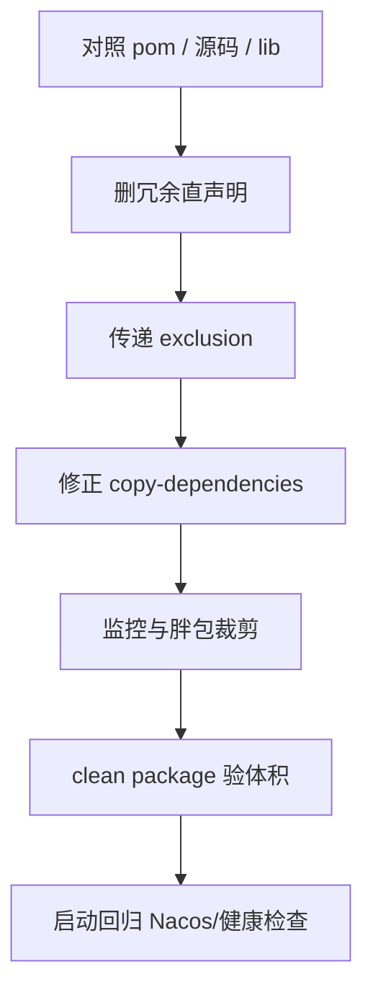
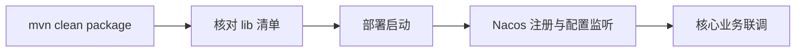

 


# 背景

maven构建微服务jar，发现jar已经达到200多M，容器运行占用内存越来越大，为了解决这个问题，对微服务依赖进行优化，最终优化希望打成的目标如下：
> 排除scope作用域的依赖，冗余直声明/测试包/Tomcat/重复，例如spring-boot-test、junit、lombok等
> 排除optional类型传递依赖项，部署运行中间件已包含servlet-api.jar等
> 排除未明确使用或过时依赖项，性能监控p6spy、prometheus等

**环境示例：**

| 角色    | 示例地址                                                           |
|:------|:---------------------------------------------------------------|
| 构建机   | `10.20.35.88`                                                  |
| 模块路径  | `D:/work/ClearStream/clearstream-admin/clearstream-admin-biz`  |
| 产物目录  | `target/lib`                                                   |
| JDK   | 8                                                              |


# 环境要求


| 项       | 要求                                                                |
|:--------|:------------------------------------------------------------------|
| JDK     | 8                                                                 |
| 构建      | Maven；并行示例 `mvn clean package -DskipTests -T 1C`                  |
| Web 容器  | Undertow（排除 `spring-boot-starter-tomcat`，保留 `tomcat-embed-el`）    |
| 打包形态    | 瘦业务 jar + 外置 `lib/`（`maven-dependency-plugin` copy-dependencies）  |
| 分析原则    | 以业务引用为准；`dependency:analyze` 仅辅助（Spring 场景误报多）                    |


> `copy-dependencies` 不会清理 lib 中历史 jar，发布前必须 `clean package`。

# 优化思路



依赖处置分层：


| 层级     | 动作                                                             |
|:-------|:---------------------------------------------------------------|
| 直声明层   | 删除本模块未用或已由 common 传递的依赖                                        |
| 传递排除层  | 在入口依赖上 exclusion Tomcat、p6spy 等                                |
| 打包过滤层  | `includeScope=runtime` + 排除 lombok/byte-buddy/junit 等          |
| 公共微调   | `common-emqx`：`hutool-all` → `hutool-core`（仅用 StrUtil/Base64）  |


# 核心步骤

## 删除冗余直声明与无效模块


| 依赖                                                               | 操作                                   |
|:-----------------------------------------------------------------|:-------------------------------------|
| xstream / freemarker / asm / commons-pool2 等                     | 删除（源码无引用）                            |
| jakarta.json* / jackson-datatype-jsr310 / servlet-api / mybatis  | 删除（已传递或随 ES 移除）                      |
| 多余 test 直声明                                                      | 合并为 `starter-test` + `security-test` |


## 修正外置 lib 打包规则

```xml
<plugin>
    <groupId>org.apache.maven.plugins</groupId>
    <artifactId>maven-shade-plugin</artifactId>
    <configuration combine.self="override">
        <createDependencyReducedPom>false</createDependencyReducedPom>
        <keepDependenciesWithProvidedScope>false</keepDependenciesWithProvidedScope>
        <artifactSet>
            <includes>
                <include>com.coship.photoframe:*</include>
            </includes>
        </artifactSet>
        <filters>
            <filter>
                <artifact>com.coship.photoframe:*</artifact>
                <excludes>
                    <exclude>META-INF/MANIFEST.MF</exclude>
                    <exclude>META-INF/*.SF</exclude>
                    <exclude>META-INF/*.DSA</exclude>
                    <exclude>META-INF/*.RSA</exclude>
                </excludes>
            </filter>
        </filters>
        <transformers>
            <transformer implementation="org.apache.maven.plugins.shade.resource.ManifestResourceTransformer">
                <mainClass>${start-class}</mainClass>
            </transformer>
            <transformer implementation="org.apache.maven.plugins.shade.resource.ServicesResourceTransformer"/>
            <transformer implementation="org.apache.maven.plugins.shade.resource.AppendingTransformer">
                <resource>META-INF/spring.factories</resource>
            </transformer>
        </transformers>
    </configuration>
    <executions>
        <execution>
            <id>default</id>
            <phase>none</phase>
        </execution>
        <execution>
            <id>shade-inner-dependencies</id>
            <phase>package</phase>
            <goals>
                <goal>shade</goal>
            </goals>
        </execution>
    </executions>
</plugin>
```

| 配置项                               | 取值       | 参数说明                                                            |
|:----------------------------------|:---------|:----------------------------------------------------------------|
| combine.self                      | override | 多模块继承时，**覆盖父POM**中shade插件配置，而非合并                                |
| createDependencyReducedPom        | false    | 不生成 `dependency-reduced-pom.xml` 精简依赖POM文件；打包后原pom.xml依赖列表不会被删减 |
| keepDependenciesWithProvidedScope | false    | scope=provided 的依赖**不会打进shade大包**，运行时由容器/环境提供                   |


## 监控策略：保留Actuator，去掉Prometheus/p6spy


| 项                                                          | 说明                                                             |
| ---------------------------------------------------------- |----------------------------------------------------------------|
| `micrometer-registry-prometheus` / `micrometer-jvm-extras` | 从模块 pom 删除                                                     |
| 启动类中仅服务 Prometheus 的 `MeterRegistryCustomizer`             | 删除                                                             |
| `p6spy-spring-boot-starter`                                | 在 service / service-pay 上 exclusion（不改公共 mybatis 以免影响其他服务）     |
| `spring-boot-starter-actuator`                             | **保留**（`/actuator/health`、security `/actuator/`** 白名单、与兄弟服务一致） |

| 节点                 | 配置值                     | 说明                                                                    |
|:-------------------|:------------------------|:----------------------------------------------------------------------|
| includes / include | com.coship.photoframe:* | 仅将 groupId=com.coship.photoframe 的所有子模块打入最终shade‑jar；**第三方依赖不会被打进包内** |


| 节点                            | 配置值                       | 说明                                      |
|:------------------------------|:--------------------------|:----------------------------------------|
| filter.artifact               | com.coship.photoframe:*   | 过滤作用范围：仅对 com.coship.photoframe 下的jar生效 |
| excludes‑MANIFEST.MF          | META‑INF/MANIFEST.MF      | 排除子模块自带清单文件，避免冲突，最终清单由Transformer统一生成   |
| excludes‑*.SF / *.DSA / *.RSA | META‑INF/*.SF、*.DSA、*.RSA | 移除Jar数字签名文件，防止合并后报签名校验失败异常              |

| 转换器实现类                      | 子参数                                | 功能描述                                                                        |
|:----------------------------|:-----------------------------------|:----------------------------------------------------------------------------|
| ManifestResourceTransformer | mainClass=${start-class}           | 生成Jar清单文件，指定可执行入口主类；变量start-class需在pom属性中定义                                 |
| ServicesResourceTransformer | -                                  | 自动合并 META‑INF/services/** Java SPI配置文件，解决多个依赖SPI文件互相覆盖丢失问题                  |
| AppendingTransformer        | resource=META‑INF/spring.factories | 追加合并spring.factories文件内容，防止多个spring‑boot自动配置的factories文件覆盖丢失，SpringBoot项目必备 |

| execution‑id             | phase   | goals | 执行说明                                      |
|:-------------------------|:--------|:------|:------------------------------------------|
| default                  | none    | -     | 关闭插件默认绑定生命周期，默认不执行shade打包                 |
| shade-inner-dependencies | package | shade | 在Maven package阶段触发 shade目标，执行重打包生成shade产物 |

## hutool去重

`common-emqx` 实际只用 `StrUtil`/`Base64`：将 `hutool-all`（约 2.4MB）改为 `hutool-core`，避免与其它模块化 `hutool-*` 功能重复。

## 必须保留的业务依赖


| 依赖                                       | 证据/用途                       |
| ---------------------------------------- | --------------------------- |
| common-service-pay                       | 异常订单补录验单（携带支付 SDK）          |
| common-ai（经 service）                     | AI 结果管理；全包扫描下不可简单 exclusion |
| easy-captcha / univocity / httpclient    | 验证码、CSV、短信工具                |
| actuator / undertow / nacos / security 等 | 启动与运维基座                     |


# 验证




| 检查项  | 预期                                                                                                                         |
| ---- |----------------------------------------------------------------------------------------------------------------------------|
| 构建   | `mvn clean package -DskipTests -T 1C` 成功                                                                                   |
| 体积   | jar 数约 350；`target/lib` 约 205MB                                                                                            |
| 不应存在 | `hutool-all`、`elasticsearch-java`、`p6spy*`、`micrometer-registry-prometheus`、`tomcat-embed-core`、junit/mockito/assertj 等测试包 |
| 应存在  | `spring-boot-starter-actuator`、`undertow-*`、支付/AI SDK、`simpleclient-*.jar`                                                 |
| 启动   | Nacos 注册成功；配置监听阶段无 `NoClassDefFoundError: io.prometheus.client.Gauge`                                                      |
| 业务   | 服务启动正常，接口访问正常                                                                                                              |


瘦身后lib体积


| 能力                      | 瘦身后               |
|:------------------------|:------------------|
| `/actuator/health`      | 可用                |
| `/actuator/prometheus`  | 不可用               |
| p6spy SQL 输出            | 关闭                |
| ES 配置拉取                 | 关闭                |


# 常见问题


| 问题                                                      | 原因                                         | 处理                                                            |
|:--------------------------------------------------------|:-------------------------------------------|:--------------------------------------------------------------|
| 启动报 `NoClassDefFoundError: io.prometheus.client.Gauge`  | 误把 `simpleclient*` 从 copy-dependencies 排除  | 保留 `simpleclient-*.jar`；仍可不引入 micrometer Prometheus registry  |
| lib 体积「没降下来」                                            | 未 `clean`，旧 jar 残留                         | 重新 `mvn clean package`                                        |
| 去掉 Actuator 后健康检查/白名单异常                                 | Actuator 不只服务 Prometheus                   | 还原 `spring-boot-starter-actuator`                             |
| 想再砍 60MB+                                               | alipay/stripe/volc 来自 pay/ai 业务链           | 另立项：common-service 可选依赖 + `@ConditionalOnClass`               |
| `dependency:analyze` 全是 Unused                          | Spring 自动配置误报                              | 以 Controller/Service import 与启动配置为准                           |
| docker 部署 lib 仍是旧的                                      | 流水线未同步 `target/lib`                        | 构建产物拷贝到镜像/挂载目录后再发版                                            |


