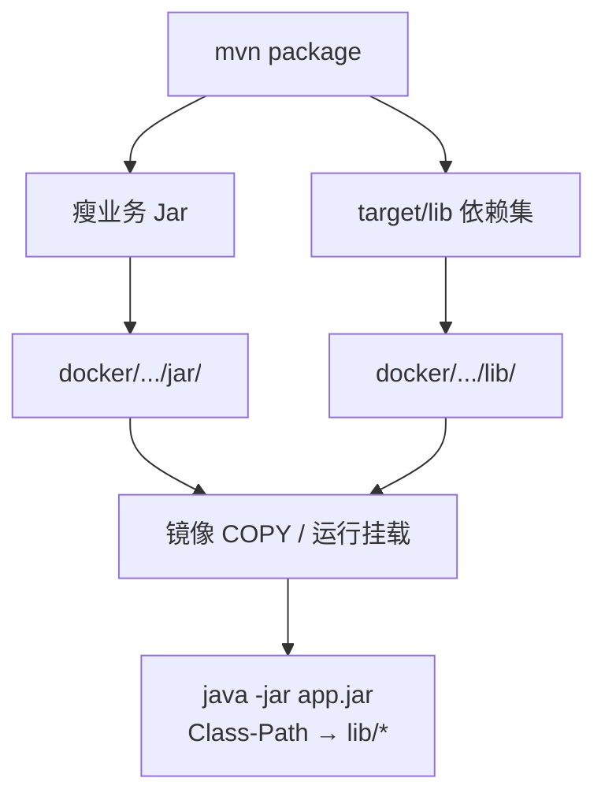

<!-- toc -->

# 背景

项目微服务模块基于Docker环境部署，微服务容器直接挂载运行时SpringBoot jar包，由于jar包依赖过多，体积越来越大，导致每次服务更新文件传输都耗时严重，希望通过优化微服务maven 构建打包方式，将微服务的项目代码和第三方依赖jar分离，达到可以根据项目依赖变更，选择单独更新项目jar包或者更新构建出的第三方依赖lib目录下的依赖。

| 项    | 说明                                                                        |
|:-----|:--------------------------------------------------------------------------|
| 问题   | FatJar 体积大；业务与依赖耦合，发布与传输成本高                                               |
| 优化   | 瘦 Jar + `copy-dependencies` 外置 lib；Manifest 声明 Class-Path；产物同步到 docker 目录 |
| 效果   | 依赖可复用挂载；业务热更新不必重传全部依赖；构建产物可自检体积与清单                                        |
| 样板模块 | `clearstream-admin-biz`                                                   |

**环境示例：**

| 角色          | 示例地址                                              |
|:------------|:--------------------------------------------------|
| 构建机         | `10.20.35.88`                                     |
| 工程根目录       | `D:/work/ClearStream`                             |
| 模块产物        | `clearstream-admin/clearstream-admin-biz/target/` |
| docker 同步目录 | `docker/clearstream/clearstream-admin-biz/`       |

# 环境要求

| 项    | 要求                                               |
|:-----|:-------------------------------------------------|
| JDK  | 8                                                |
| 构建   | Maven；示例 `mvn clean install -T 1C -DskipTests`   |
| 打包插件 | Spring Boot 可执行瘦 Jar + `maven-dependency-plugin` |
| 依赖范围 | 外置 lib 使用 `includeScope=runtime`，避免测试包进入部署目录     |
| 启动约定 | 工作目录下同时存在业务 jar 与 `lib/`（容器内或本机一致）               |

> `copy-dependencies` 不会清理历史 jar，重新打包前必须 `clean`。

# 目标产物形态



| 对比项      | FatJar 模式        | 依赖分离模式                  |
|:---------|:-----------------|:------------------------|
| 业务包      | 含依赖的大包           | 仅业务与少量启动元数据             |
| 依赖       | 打进同一 jar         | 外置 `lib/*.jar`          |
| Manifest | 通常无外部 Class-Path | 含 `Class-Path: lib/...` |
| 仅改业务     | 整包重传             | 可只换瘦 Jar（lib 未变时）       |

docker 模块目录约定：

```text
docker/clearstream/<模块名>/
  ├── jar/<模块名>.jar
  ├── lib/*.jar
  └── Dockerfile
```

# 核心步骤

## 配置瘦 Jar 与外置依赖复制

业务模块关闭「依赖打进可执行包」的 Fat 布局，保留可执行入口；另用 `copy-dependencies` 输出到 `target/lib`（或约定目录）。

```xml
<!-- 示意：copy-dependencies 关键配置 -->
<plugin>
  <groupId>org.apache.maven.plugins</groupId>
  <artifactId>maven-dependency-plugin</artifactId>
  <executions>
    <execution>
      <id>copy-dependencies</id>
      <phase>package</phase>
      <goals>
        <goal>copy-dependencies</goal>
      </goals>
      <configuration>
        <outputDirectory>${project.build.directory}/lib</outputDirectory>
        <includeScope>runtime</includeScope>
        <excludeArtifactIds>
          lombok,
          byte-buddy,byte-buddy-agent,
          junit
        </excludeArtifactIds>
      </configuration>
    </execution>
  </executions>
</plugin>
```

| 参数                             | 含义                            |
|:-------------------------------|:------------------------------|
| `includeScope=runtime`         | 仅复制运行时依赖                      |
| 排除 lombok / byte-buddy / junit | 避免编译期或误标 compile 的测试相关包进入 lib |
| 输出目录                           | 与启动工作目录下的 `lib/` 对应           |

> 若运行时使用 Nacos 等组件且硬依赖 `simpleclient`，不要误排除 `simpleclient*`，否则启动期可能 `NoClassDefFoundError`。

## 保证 Manifest 可找到 lib

瘦 Jar 的 `META-INF/MANIFEST.MF` 需包含指向 `lib/` 的 `Class-Path`（由 Spring Boot / 打包插件按项目约定生成）。启动时工作目录应为 jar 所在目录，且同级存在 `lib/`。

```bash
unzip -p target/clearstream-admin-biz.jar META-INF/MANIFEST.MF
```

## 构建并同步到 docker 目录

```bash
# 按环境激活对应 Maven profile 后执行（命令不加 -P）
mvn clean install -T 1C -DskipTests

cd docker
sh copy.sh
```

| 检查项             | 期望                                |
|:----------------|:----------------------------------|
| `.../jar/*.jar` | 瘦 Jar，体积远小于原 FatJar               |
| `.../lib/`      | 存在且含大量依赖 jar                      |
| jar 与 lib       | 来自**同一次** `mvn clean install`构建输出 |

## Dockerfile 中的拷贝约定

镜像构建上下文内同时带上瘦 Jar 与 lib（运行环境也可改为宿主机挂载覆盖 lib，但构建批次仍须一致）：

```dockerfile
WORKDIR /home/clearstream
COPY lib lib/
COPY jar/clearstream-admin-biz.jar .
CMD ["java", "-jar", "clearstream-admin-biz.jar"]
```

## 变更后的发布策略

| 变更类型         | 动作                                  |
|:-------------|:------------------------------------|
| 仅业务代码        | 重新打包瘦 Jar，更新 `jar/`；lib 未变则不必重传全部依赖 |
| 依赖变更（pom 增减） | 同步更新 `lib/`，并视情况重建应用镜像              |
| 混用不同构建批次     | **禁止**；易出现 ClassNotFound 或行为漂移      |

# 验证


| 检查项      | 预期                                       |
|:---------|:-----------------------------------------|
| 构建       | `mvn clean package -DskipTests -T 1C` 成功 |
| 瘦 Jar    | 体积明显小于原 FatJar                           |
| lib      | 目录非空；无测试包（junit/mockito 等）误入             |
| Manifest | 含 `Class-Path: lib/...`                  |
| 本地试跑     | 在含 `lib/` 的工作目录执行 `java -jar` 可启动到框架阶段   |

# 常见问题

| 问题                       | 原因                         | 处理                            |
|:-------------------------|:---------------------------|:------------------------------|
| `ClassNotFoundException` | 缺少 lib、路径不对，或 jar/lib 不同批次 | 确认工作目录与 Class-Path；用同一次构建产物   |
| lib「越拷越大」                | 未 `clean`，旧 jar 残留         | `mvn clean package` 后重新 copy  |
| 测试包进了 lib                | scope 未限制或 SDK 误标 compile  | `includeScope=runtime` + 排除名单 |
| 只换了瘦 Jar 仍报缺类            | 依赖已变却未更新 lib               | 依赖变更必须同步 lib                  |


完成瘦 Jar 与外置 lib 的构建同步后，即可将该产物用于镜像构建或运行时双挂载部署。
