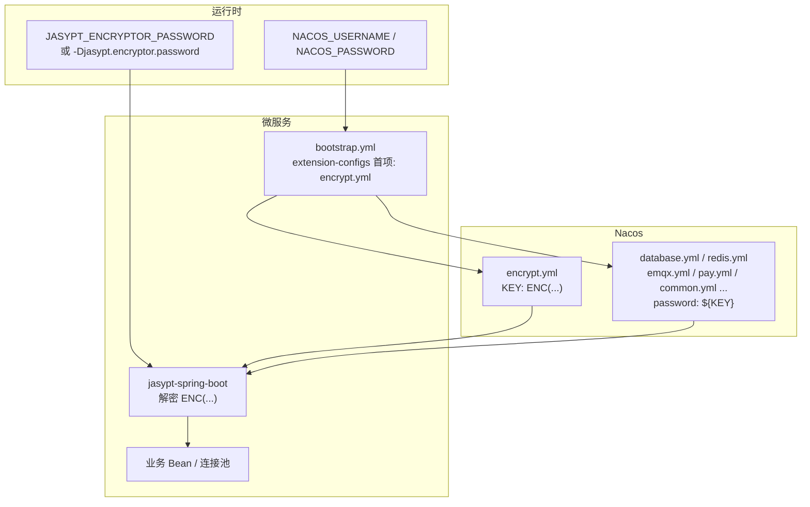

<!-- toc -->

# <span id="inline-blue">概述</span>

在 Spring Cloud 微服务体系中，MySQL、Redis、Elasticsearch、RabbitMQ、支付密钥、对象存储 AK/SK、EMQX、第三方登录 Client Secret 等敏感信息若以明文散落在各 Nacos data-id 中，存在泄露与变更成本高的问题。本文介绍一套在现有 **Nacos 扩展配置 + jasypt-spring-boot-starter 3.0.4** 基础上落地的方案：用独立的 `encrypt.yml` 集中存放 `ENC(密文)`，业务配置通过 `${VAR}` 引用，运行时仅外置 Jasypt 主密钥。

文中涉及的服务器地址、仓库名、人员信息、真实密钥均已脱敏。本文按 Hexo 单篇拷贝部署编写，**不依赖仓库内其它文档链接**；关键配置片段均内联给出。

| 项 | 说明 |
|----|------|
| 框架 | Spring Boot 2.6.x / Spring Cloud Alibaba（Nacos Config） |
| JDK | 1.8 |
| 加密组件 | `jasypt-spring-boot-starter` **3.0.4** |
| 插件 | `jasypt-maven-plugin` **3.0.4** |
| 算法 | `PBEWITHHMACSHA512ANDAES_256` |
| 配置中心 | Nacos，data-id=`encrypt.yml`，经 `extension-configs` 首项加载 |
| 验证方式 | 本地 IDEA / Linux `java -jar` / Docker Swarm stack |

**环境示例：**

| 角色 | 示例地址 |
|------|----------|
| Nacos | `http://<nacos-host>:8848` |
| 微服务 | `http://<app-host>:<port>` |
| 工程根目录 | `/path/to/<repo-root>` |

# <span id="inline-blue">改造目标与范围</span>

## 目标

| 目标 | 说明 |
|------|------|
| 敏感数据集中 | 密文只进 `encrypt.yml`，业务 yml 只保留 `${VAR}` 或直接绑定路径 |
| 统一算法 | 与各服务 bootstrap 中 jasypt 配置一致 |
| 主密钥外置 | `JASYPT_ENCRYPTOR_PASSWORD` / `-Djasypt.encryptor.password` 不进 Nacos、不进 Git |
| 运维可查 | 用官方 Maven 插件批量 `DEC`↔`ENC` |

## 纳入加密的配置类别

| 类别 | 示例 |
|------|------|
| 基础设施 | MySQL、Redis、ES、RabbitMQ |
| 消息 / IoT | EMQX Secret、API Key、客户端账号 |
| 支付 | Stripe / 支付宝 / 微信等 |
| 存储 | 阿里云 OSS AccessKey |
| 第三方登录 | JustAuth `client-id` / `client-secret` |
| 其它 | 邮件、JPUSH、OAuth2、Knife4j Basic 等 |

**不进 `encrypt.yml`：**

| 项 | 原因 |
|----|------|
| `NACOS_USERNAME` / `NACOS_PASSWORD` | bootstrap 拉取配置前即需要 |
| `JASYPT_ENCRYPTOR_PASSWORD` | 解密根密钥，写入 Nacos 等于明文泄露 |

# <span id="inline-blue">整体架构</span>



# <span id="inline-blue">依赖与 Jasypt 配置（内联）</span>

## Maven 依赖与插件

在父 POM / 各微服务模块中声明（版本与工程一致即可）：

```xml
<dependency>
  <groupId>com.github.ulisesbocchio</groupId>
  <artifactId>jasypt-spring-boot-starter</artifactId>
  <version>3.0.4</version>
</dependency>

<!-- build/plugins -->
<plugin>
  <groupId>com.github.ulisesbocchio</groupId>
  <artifactId>jasypt-maven-plugin</artifactId>
  <version>3.0.4</version>
</plugin>
```

## bootstrap.yml 中的算法与 Nacos 扩展配置

各微服务 `bootstrap.yml` 需同时具备：① jasypt 算法配置；② `extension-configs` **第一项**加载 `encrypt.yml`。示例如下（group / namespace / address 按环境替换）：

```yaml
spring:
  application:
    name: <service-name>
  cloud:
    nacos:
      config:
        extension-configs:
          - data-id: encrypt.yml
            group: <nacos-group>
            refresh: true
          - data-id: database.yml
            group: <nacos-group>
            refresh: true
          - data-id: redis.yml
            group: <nacos-group>
            refresh: true
          - data-id: common.yml
            group: <nacos-group>
            refresh: true
          # ... 其它共享配置按服务裁剪
        file-extension: yml
        group: <nacos-group>
        namespace: <nacos-namespace>
        prefix: <service-name>
        refresh-enabled: true
        server-addr: <nacos-host>:8848
        username: ${NACOS_USERNAME:}
        password: ${NACOS_PASSWORD:}
      discovery:
        group: <nacos-group>
        namespace: <nacos-namespace>
        server-addr: <nacos-host>:8848
        username: ${NACOS_USERNAME:}
        password: ${NACOS_PASSWORD:}

jasypt:
  encryptor:
    algorithm: PBEWITHHMACSHA512ANDAES_256
    key-obtention-iterations: 1000
    pool-size: 1
    salt-generator-classname: org.jasypt.salt.RandomSaltGenerator
    iv-generator-classname: org.jasypt.iv.RandomIvGenerator
    string-output-type: base64
```

> 后加载的 extension-config 对同名 key 优先级更高；`encrypt.yml` 置顶便于约定密文清单位置。`${VAR}` 解析时，只要 Environment 中存在对应属性即可。

# <span id="inline-blue">配置契约与样例（内联）</span>

## encrypt.yml：加密前用 DEC，加密后用 ENC

**安全要求：** 真实明文勿提交 Git；上传 Nacos 的应为 `ENC(...)` 版本。

明文模板（编辑后执行批量加密）：

```yaml
# ---- 数据库 ----
DATABASE_USERNAME: DEC(change_me)
DATABASE_PASSWORD: DEC(change_me)

# ---- Redis ----
REDIS_PASSWORD: DEC(change_me)

# ---- Elasticsearch（API Key 与账号密码二选一）----
ELASTICSEARCH_API_KEY: DEC()
ELASTICSEARCH_USERNAME: DEC()
ELASTICSEARCH_PASSWORD: DEC()

# ---- RabbitMQ ----
RABBITMQ_USERNAME: DEC(change_me)
RABBITMQ_PASSWORD: DEC(change_me)

# ---- EMQX ----
EMQX_SECRET: DEC(change_me)
EMQX_API_KEY: DEC(change_me)
EMQX_SECRET_KEY: DEC(change_me)
EMQX_USERNAME: DEC(change_me)
EMQX_PASSWORD: DEC(change_me)

# ---- Knife4j：建议直接绑定业务属性路径，减少与环境变量撞名 ----
knife4j.basic.username: DEC(change_me)
knife4j.basic.password: DEC(change_me)

# ---- 支付 Stripe ----
STRIPE_SECRET_KEY: DEC(change_me)
STRIPE_PUBLIC_KEY: DEC(change_me)
STRIPE_WEB_HOOK_SECRET: DEC(change_me)

# ---- 支付 支付宝 / 微信 ----
ALIPAY_APP_ID: DEC(change_me)
ALIPAY_PRIVATE_KEY: DEC(change_me)
ALIPAY_PUBLIC_KEY: DEC(change_me)
WXPAY_APP_ID: DEC(change_me)
WXPAY_MCH_ID: DEC(change_me)
WXPAY_PARTNER_KEY: DEC(change_me)
WXPAY_API_KEY_3: DEC(change_me)

# ---- 阿里云 OSS ----
ALIYUN_ACCESS_KEY: DEC(change_me)
ALIYUN_SECRET_KEY: DEC(change_me)
ALIYUN_BUCKET_NAME: DEC(change_me)

# ---- 邮件 / 极光 / OAuth2 等 ----
MAIL_PASSWORD: DEC(change_me)
JPUSH_APP_KEY: DEC(change_me)
JPUSH_APP_SECRET: DEC(change_me)
OAUTH2_CLIENT_ID: DEC(change_me)
OAUTH2_CLIENT_SECRET: DEC(change_me)
```

加密后形态示例：

```yaml
DATABASE_PASSWORD: ENC(<base64-ciphertext>)
REDIS_PASSWORD: ENC(<base64-ciphertext>)
knife4j.basic.password: ENC(<base64-ciphertext>)
```

| 约定 | 说明 |
|------|------|
| 必须 `ENC(...)` | 裸密文不会被 jasypt-spring-boot 自动解密 |
| 扁平键名 | 如 `REDIS_PASSWORD`，供业务 yml `${REDIS_PASSWORD}` 引用 |
| 可选直绑路径 | 如 `knife4j.basic.password: ENC(...)`，避免 `KNIFE4J_PASSWORD` 与空环境变量撞名 |

## 业务配置如何引用

**方式 A（推荐用于大部分组件）：** encrypt 扁平键 + 业务 yml 占位符。

```yaml
# database.yml（节选）
spring:
  datasource:
    username: ${DATABASE_USERNAME}
    password: ${DATABASE_PASSWORD}
    type: com.zaxxer.hikari.HikariDataSource
    url: jdbc:mysql://<mysql-host>:3306/<db-name>?useUnicode=true&characterEncoding=utf8&serverTimezone=GMT%2B8

# redis.yml（节选）
spring:
  redis:
    host: <redis-host>
    port: 6379
    password: ${REDIS_PASSWORD:}
```

```yaml
# emqx.yml（节选）
emqx:
  config:
    auth:
      secret: ${EMQX_SECRET}
    api:
      apiKey: ${EMQX_API_KEY}
      secretKey: ${EMQX_SECRET_KEY}
    client:
      username: ${EMQX_USERNAME}
      password: ${EMQX_PASSWORD}
```

**方式 B（推荐用于易与环境变量撞名的项，如 Knife4j）：** 在 `encrypt.yml` 写真实配置路径，业务 yml **不要再写** `${KNIFE4J_*}`。

```yaml
# encrypt.yml
knife4j.basic.username: ENC(...)
knife4j.basic.password: ENC(...)

# common.yml（节选）—— 仅保留开关，账号密码来自 encrypt.yml
knife4j:
  enable: true
  basic:
    enable: true
    # 不要写 username/password: ${KNIFE4J_*}
```

## `${VAR}` 解析说明

`${REDIS_PASSWORD}` 是 Spring Boot **属性占位符**，在整个 `Environment` 中查找同名属性，来源包括：

| 来源 | 说明 |
|------|------|
| 命令行 / `-D` | 系统属性 |
| OS / IDEA Environment | 同名环境变量会映射成属性 |
| Nacos（含 encrypt.yml） | 如 `REDIS_PASSWORD: ENC(...)` |

键名写成 `SCREAMING_SNAKE` 只是运维习惯；若系统存在**空的**同名环境变量，可能覆盖 Nacos 密文，业务侧得到空字符串。

# <span id="inline-blue">核心步骤：批量加解密</span>

加解密使用官方 `jasypt-maven-plugin`，须在**已声明该插件的微服务模块根目录**执行。

## 生成主密钥

```bash
openssl rand -base64 32
export JASYPT_ENCRYPTOR_PASSWORD='YOUR_ENCRYPTOR_PASSWORD'
```

## 批量加密（DEC → ENC）

```bash
cd /path/to/<repo-root>/<module-with-jasypt-plugin>

mvn jasypt:encrypt \
  -Djasypt.encryptor.password="YOUR_ENCRYPTOR_PASSWORD" \
  -Djasypt.plugin.path=file:/path/to/encrypt.yml
```

| 参数 | 含义 |
|------|------|
| `jasypt.encryptor.password` | 与运行时主密钥一致 |
| `jasypt.plugin.path` | 含 `DEC(...)` 的目标文件（`file:` + 绝对路径） |

插件将 `DEC(明文)` **原地**替换为 `ENC(密文)`，再上传 Nacos（data-id=`encrypt.yml`）。

## 批量解密（ENC → 控制台输出 DEC）

```bash
mvn jasypt:decrypt \
  -Djasypt.encryptor.password="YOUR_ENCRYPTOR_PASSWORD" \
  -Djasypt.plugin.path=file:/path/to/encrypt.yml
```

控制台输出 `DEC(明文)`；产物含敏感信息，用完即删，禁止入库。

## 单值加解密

```bash
mvn jasypt:encrypt-value \
  -Djasypt.encryptor.password="YOUR_ENCRYPTOR_PASSWORD" \
  -Djasypt.plugin.value="your_plaintext_value"

mvn jasypt:decrypt-value \
  -Djasypt.encryptor.password="YOUR_ENCRYPTOR_PASSWORD" \
  -Djasypt.plugin.value="YOUR_ENCRYPTED_VALUE"
```

# <span id="inline-blue">运行时注入主密钥</span>

Jasypt Starter 读取 Spring 属性 **`jasypt.encryptor.password`**。下列两种方式等价：

| 方式 | 示例 |
|------|------|
| JVM 系统属性 | `-Djasypt.encryptor.password=xxx` |
| 环境变量 | `JASYPT_ENCRYPTOR_PASSWORD=xxx`（Relaxed Binding → 同上属性） |

## Linux 启动脚本示例

```bash
#!/bin/bash
server_name=<service-name>
jar_name=${server_name}.jar

if [ -z "${JASYPT_ENCRYPTOR_PASSWORD}" ]; then
  echo "ERROR: JASYPT_ENCRYPTOR_PASSWORD is empty"
  exit 1
fi

pid=$(ps -ef | grep "$jar_name" | grep -v grep | awk '{print $2}')
[ -n "$pid" ] && kill -9 $pid

nohup java \
  -Dproject.name=$server_name \
  -Djava.awt.headless=true \
  -Djasypt.encryptor.password="${JASYPT_ENCRYPTOR_PASSWORD}" \
  -jar "$jar_name" > ./info.log &
```

也可只依赖环境变量、不写 `-D`：保证进程环境中已有非空 `JASYPT_ENCRYPTOR_PASSWORD` 即可。

## IDEA 本地启动

VM options：

```text
-Djasypt.encryptor.password=YOUR_ENCRYPTOR_PASSWORD
```

Environment 至少配置 `NACOS_USERNAME` / `NACOS_PASSWORD`。

## Docker Swarm

Stack 注入环境变量即可，**不必**再写 `-Djasypt.encryptor.password`：

```yaml
services:
  <service-name>:
    image: <registry>/<image>:<tag>
    environment:
      JASYPT_ENCRYPTOR_PASSWORD: ${JASYPT_ENCRYPTOR_PASSWORD}
      NACOS_USERNAME: ${NACOS_USERNAME}
      NACOS_PASSWORD: ${NACOS_PASSWORD}
```

| 说明 | 内容 |
|------|------|
| 原理 | 容器环境变量经 Relaxed Binding 绑定为 `jasypt.encryptor.password` |
| deploy 展开 | `${JASYPT_ENCRYPTOR_PASSWORD}` 取自 **管理节点** 环境；节点未设置则容器内为空 |
| 是否重建镜像 | 仅改 Nacos / 环境变量：**不需要**；改了 `bootstrap.yml` 或 Java 代码：**需要**重建并滚动更新 |

# <span id="inline-blue">配置与验证</span>

| 检查项 | 预期 |
|--------|------|
| 各服务 bootstrap | 首项加载 `encrypt.yml`，且含 jasypt 算法段 |
| Nacos encrypt.yml | 值为 `ENC(...)`，group/namespace 正确 |
| 业务 yml | `${REDIS_PASSWORD}` 等与 encrypt 键名一致 |
| 主密钥 | 当前会话 `echo "$JASYPT_ENCRYPTOR_PASSWORD"` 非空 |
| 启动日志 | 无 placeholder 无法解析、无 `Password cannot be set empty` |
| 连通性 | DB / Redis / 支付等依赖可正常连接 |

# <span id="inline-blue">常见问题</span>

| 问题 | 原因 | 处理 |
|------|------|------|
| `knife4j.basic.password` 报 `Password cannot be set empty` | ① 主密钥未进入进程；② 空环境变量覆盖 `${KNIFE4J_PASSWORD}` | 确认主密钥非空；删除空的 `KNIFE4J_*`；或改用 `knife4j.basic.password: ENC(...)` 直绑 |
| `/etc/profile` 已配主密钥，但 `echo` 仍为空 | profile 仅登录 shell 加载，未重开 / 未 `source` | `source /etc/profile` 或重新 SSH 后再启动 |
| Swarm 已写 environment 仍解密失败 | deploy 时节点变量为空，展开进容器仍为空 | 管理节点 export 后再 `stack deploy`；或改用 Docker Secret（可二期） |
| 只改了 Nacos，行为未变 | 连接池可能不热更新密码；镜像仍是旧 bootstrap | 滚动重启；缺加载项则重建镜像 |
| 批量加密无效果 | 文件不是 `DEC(...)`，或不在含插件的模块目录执行 | 使用 `DEC(明文)`；`cd` 到对应模块再执行 |

# <span id="inline-blue">完整命令清单</span>

```bash
# ── 1. 生成并导出主密钥 ──
openssl rand -base64 32
export JASYPT_ENCRYPTOR_PASSWORD='YOUR_ENCRYPTOR_PASSWORD'

# ── 2. 编辑含 DEC(...) 的 encrypt.yml 后批量加密 ──
cd /path/to/<repo-root>/<module-with-jasypt-plugin>
mvn jasypt:encrypt \
  -Djasypt.encryptor.password="$JASYPT_ENCRYPTOR_PASSWORD" \
  -Djasypt.plugin.path=file:/path/to/encrypt.yml
# 将加密后的文件上传 Nacos：data-id=encrypt.yml

# ── 3. 可选：核对解密 ──
mvn jasypt:decrypt \
  -Djasypt.encryptor.password="$JASYPT_ENCRYPTOR_PASSWORD" \
  -Djasypt.plugin.path=file:/path/to/encrypt.yml

# ── 4. Linux 启动前确认 ──
source /etc/profile   # 若主密钥写在 profile
echo "$JASYPT_ENCRYPTOR_PASSWORD"

# ── 5. Swarm 部署前（管理节点）──
export JASYPT_ENCRYPTOR_PASSWORD='YOUR_ENCRYPTOR_PASSWORD'
export NACOS_USERNAME='<nacos-user>'
export NACOS_PASSWORD='<nacos-password>'
docker stack deploy -c <stack-file>.yml <stack-name>
```

完成以上步骤后，日常密文变更只需更新 Nacos `encrypt.yml` 并滚动重启相关服务；主密钥始终仅通过环境变量或 JVM 参数注入，勿写入配置中心与镜像。
