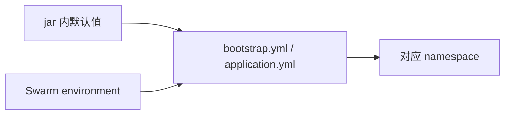

---

title: 微服务镜像兼容多环境的Docker Swarm部署实践  
categories:  
	- Docker  
tags:  
	- Docker Swarm
    - Docker 
	- Nacos  
	- Spring Cloud

date: 2026-08-20 17:17:16
updated: 2026-08-20 17:44:04

---

# 概述

SpringCloud 微服务项目通过Docker构建镜像部署，目前项目构建打包，微服务模块启动配置bootstrap.yml和application.yml文件中，nacos连接参数spring.cloud.nacos.config.server-addr、spring.cloud.nacos.config.namespace、spring.cloud.nacos.config.group等参数，以及application.yml配置文件中spring.profiles.active通过maven pom.xml定义对应动态切换properties变量动态传入，导致微服务镜像运行环境直接在构建阶段固定，在存在多个微服务多个部署环境的情况下，需要构建多个版本镜像，对Harbor仓库中微服务镜像的管理增加了不少复杂度，本文将通过借助环境变量实现微服务镜像兼容多个不同部署环境,项目优化改造的最终效果将实现如下几点：
1. 优化微服务镜像构建，实现微服务镜像兼容多个不同部署环境，减少Harbor仓库中微服务镜像数量
2. 优化微服务镜像部署，实现微服务镜像在不同部署环境之间快速切换，减少微服务镜像部署的复杂度
3. 本次优化改造不影响现有的Docker swarm部署流程，微服务通过maven动态指定默认环境构建出来的jar直接挂载到容器对应目录依旧可以正常运行
4. idea工具可以正常Debug调试模块代码，不需要更改任何配置

| 项     | 说明                                                        |
|:------|:----------------------------------------------------------|
| 目标    | 同一业务镜像可在不同环境启动，连到该环境的 Nacos namespace                     |
| 改动面   | `bootstrap.yml`、`application.yml`、Swarm 堆栈 `environment`  |
| 不改    | Dockerfile、中间件启动参数、Nacos 里的业务配置内容                         |
| 配置中心  | Nacos；Maven 资源过滤分隔符为 `@`，`${}` 不会被打包替换                    |


**环境示例：**


| 角色         | 示例地址                                           |
| ---------- | ---------------------------------------------- |
| 镜像仓库       | `https://<registry-host>:<port>`               |
| 统一镜像       | `<registry-host>:<port>/<project>/<服务名>:<tag>` |
| Nacos（集群内） | `http://<nacos-svc>:8848`                      |
| Gateway    | `http://<swarm-node>:9001`                     |





# 改造思路

改造关键点都发生在「镜像构建期」而不是「容器运行期」。


| 关键点         | 现象                                            | 思路                                    |
|:------------|:----------------------------------------------|:--------------------------------------|
| 连接参数写进 jar  | Maven 把 `@nacos-namespace@` 等替换成字面量，镜像绑死某一个环境 | 改成 `${ENV:Maven默认值}`，有注入用注入，没有注入回退默认  |
| 镜像路径带环境名    | `…/<project>-prod/<服务>:latest`，三套集群无法引用同一坐标   | 仓库路径去掉环境名；环境只体现在容器 env 和数据卷           |


只给容器加 `SPRING_CLOUD_NACOS_*` 不够：`extension-configs` 是 YAML 列表，列表项 `group` 不能用扁平环境变量稳定覆盖；网关若还有 Sentinel 的嵌套 Nacos 数据源，漏改一处就会连错 namespace。所以 **YAML 里每一处 namespace / group / server-addr 都走同一套环境变量**。

`${VAR}` 在 Swarm 里是 **deploy 当时插值一次**，写进服务规格。容器不会回头读宿主机 `/etc/profile`。


| 变量                                   | 作用                  | 与谁成对                           |
|:-------------------------------------|:--------------------|:-------------------------------|
| `NACOS_NAMESPACE`                    | 配中心与注册中心的 namespace | 须与 `SPRING_PROFILES_ACTIVE` 成对 |
| `NACOS_SERVER_ADDR`                  | Nacos 地址            | 集群内一般是服务名                      |
| `NACOS_GROUP`                        | 配置 group            | 与现网 group 保持一致                 |
| `SPRING_PROFILES_ACTIVE`             | SpringBoot激活加载环境    | nacos对应命名空间                    |
| `NACOS_USERNAME` / `NACOS_PASSWORD`  | 登录凭据                | 密钥，YAML 只写 `${…}`，不写明文         |
| `SENTINEL_DASHBOARD_ADDR`            | 仅网关需要               | 有 Sentinel 再加                  |


**安全要求：** 密钥不要写进compose `.env`或堆栈YAML明文。CLI 部署从当前 shell 展开；Portainer在线YAML从**该 Stack的Environment variables**展开，不是宿主机 `/etc/profile`。

# 核心步骤

各业务微服务改法相同，下面用一份示意覆盖全部服务，不必按模块逐个对照。

## bootstrap.yml：连接参数改为环境变量优先

把 Maven 占位改成「环境变量优先、maven配置打包值兜底」。`username` / `password` 若已是 `${NACOS_USERNAME:}` 则不用动。`prefix` 建议写成 `${spring.application.name}`，与应用名保持一致。


| 原文                                      | 改为                                                                 |
|:----------------------------------------|:-------------------------------------------------------------------|
| `group: @nacos-group@`                  | `group: ${NACOS_GROUP:@nacos-group@}`                              |
| `groupId: @nacos-group@`                | `groupId: ${NACOS_GROUP:@nacos-group@}`                            |
| `namespace: @nacos-namespace@`          | `namespace: ${NACOS_NAMESPACE:@nacos-namespace@}`                  |
| `server-addr: @nacos-address@`          | `server-addr: ${NACOS_SERVER_ADDR:@nacos-address@}`                |
| `dashboard: @sentinel-dashboard-addr@`  | `dashboard: ${SENTINEL_DASHBOARD_ADDR:@sentinel-dashboard-addr@}`  |


```yaml
spring:
  cloud:
    nacos:
      config:
        extension-configs:
        - data-id: encrypt.yml
          group: ${NACOS_GROUP:@nacos-group@}
          refresh: true
        group: ${NACOS_GROUP:@nacos-group@}
        namespace: ${NACOS_NAMESPACE:@nacos-namespace@}
        prefix: ${spring.application.name}
        server-addr: ${NACOS_SERVER_ADDR:@nacos-address@}
        username: ${NACOS_USERNAME:}
        password: ${NACOS_PASSWORD:}
      discovery:
        group: ${NACOS_GROUP:@nacos-group@}
        namespace: ${NACOS_NAMESPACE:@nacos-namespace@}
        server-addr: ${NACOS_SERVER_ADDR:@nacos-address@}
```

有 Sentinel 数据源时，每一处 `namespace` / `groupId` / `server-addr` 用同一规则改，不要只改 `config.namespace`。合入前检索，不允许残留裸 `@nacos-group@`。

根 POM 须 `useDefaultDelimiters=false`、分隔符为 `@`，否则 `${NACOS_NAMESPACE:…}` 会被 Maven 吃掉。

## application.yml：profile环境变量优先

`spring.profiles.active` 若在打包时写成 `dev` / `test` / `prod`，堆栈只注入 `NACOS_NAMESPACE` 不够：网关路由、按 profile 开关的业务仍走 jar 内值，会与 namespace 错位。

原始配置：
```yml
spring:
    profiles:
        active: @activatedProperties@
    main:
        allow-bean-definition-overriding: true
        allow-circular-references: true
```

目标配置：
```yml
spring:
    profiles:
        active: ${SPRING_PROFILES_ACTIVE:@activatedProperties@}
    main:
        allow-bean-definition-overriding: true
        allow-circular-references: true
```

打包后形如 `${SPRING_PROFILES_ACTIVE:prod}`。容器里有 `SPRING_PROFILES_ACTIVE` 时以它为准。

## Swarm 堆栈：把变量注入业务容器

只给 **业务微服务** 加环境变量，mysql / nacos / redis 等中间件不加。YAML 里写插值，不写死某个环境的值。

```yaml
    environment:
      JASYPT_ENCRYPTOR_PASSWORD: ${JASYPT_ENCRYPTOR_PASSWORD}
      NACOS_USERNAME: ${NACOS_USERNAME}
      NACOS_PASSWORD: ${NACOS_PASSWORD}
      NACOS_SERVER_ADDR: ${NACOS_SERVER_ADDR:-<nacos-svc>:8848}
      NACOS_NAMESPACE: ${NACOS_NAMESPACE}
      NACOS_GROUP: ${NACOS_GROUP:-DEFAULT_GROUP_YML}
      SPRING_PROFILES_ACTIVE: ${SPRING_PROFILES_ACTIVE}
```

网关若接 Sentinel，再加一行：

```yaml
      SENTINEL_DASHBOARD_ADDR: ${SENTINEL_DASHBOARD_ADDR:-<sentinel-svc>:8180}
```

`NACOS_NAMESPACE` 不要在 YAML 里给默认值，避免未注入时静默连到错误环境；未注入时由 jar 内 Maven 默认值兜底。


| 部署方式      | 环境变量来源                          |
|:----------|:--------------------------------|
| shell     | 当前进程环境（需事先 `export`）            |
| Portainer | 该 Stack 的 Environment variables |


> Portainer 自身跑在容器里，读不到宿主机 `/etc/profile`。网页部署若只写 `${NACOS_NAMESPACE}`、Stack 环境又没填，容器里会得到空字符串。

镜像坐标建议去掉路径中的环境名，tag 用 `${IMAGE_TAG}` 而不是 `latest`，这样同一镜像名可在各环境引用。

# 配置与验证

改造是否生效，看容器拿到的变量和进程连上的 namespace，不看是否完成了某套集群的升级。


| 检查项    | 目标                                                  |
|:-------|:----------------------------------------------------|
| 容器 env | 含 `NACOS_NAMESPACE`、`SPRING_PROFILES_ACTIVE`，且二者成对  |
| 启动日志   | Nacos namespace 与容器 env 一致                          |
| 镜像更新   | namespace 仍是堆栈注入值，不被镜像盖回                            |
| 密钥     | `docker inspect` 里是插值结果；堆栈 YAML 无明文口令               |


本地验证时导出当前环境对应的一组值即可，例如：

```bash
export NACOS_NAMESPACE=<ns>-dev
export NACOS_SERVER_ADDR=<nacos-svc>:8848
export NACOS_GROUP=DEFAULT_GROUP_YML
export SPRING_PROFILES_ACTIVE=dev
```

换到另一套集群时，改的是 **这组环境变量的取值**，不是重新打镜像。

# 常见问题


| 问题                               | 原因                            | 处理                                    |
|:---------------------------------|:------------------------------|:--------------------------------------|
| Portainer 更新后 `NACOS_`* 为空       | 网页部署不读 `/etc/profile`         | YAML 保持 `${VAR}`；在 Stack 环境变量里补齐后再更新  |
| YAML 写死 `NACOS_USERNAME: nacos`  | 明文进堆栈，换环境要改文件                 | 改回 `${NACOS_USERNAME}`                |
| namespace 对了，网关路由仍走另一套 profile   | 未注入 `SPRING_PROFILES_ACTIVE`  | 与 `NACOS_NAMESPACE` 一起注入              |
| 只改了 `config.namespace`，限流规则连错    | Sentinel 等嵌套数据源未改             | 所有 `@nacos-*@` 同一规则替换                 |
| 未注入时连的仍是打包环境                     | 符合兜底设计                        | 确认 deploy 进程或 Portainer Stack 已提供变量   |


部署后看容器 `Env` 应是解析后的值，而不是字面量 `${NACOS_NAMESPACE}` 或空值。可持续对照 Nacos 控制台：实例是否落在注入的那一个 namespace。
Docker swarm模式下部署堆栈，如果微服务容器启动报错但启动日志无法查到对应的原因，可以通过docker swarm集群管理节点执行docker service inspect <service-name>命令查看微服务的容器运行是否正确挂载NACOS对应环境变量